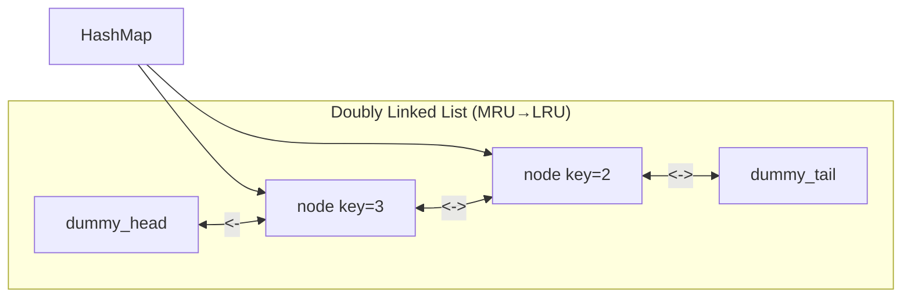

## Question

Design an LRU (Least Recently Used) cache that supports `get(key)` and `put(key, value)` in O(1) time. What data structures do you combine, and why?

## Answer

**Requirement:** On every `get` and `put`, the accessed key becomes most recently used. When capacity is exceeded, evict the least recently used key.

**Data structures:**
- **Hash map** `{key → node}`: O(1) lookup by key.
- **Doubly linked list**: maintains usage order; head = MRU, tail = LRU. O(1) insert/delete given the node pointer.



**Operations:**

`get(key)`:
1. If key not in map → return -1.
2. Move the node to head (MRU position).
3. Return value.

`put(key, value)`:
1. If key exists → update value, move to head.
2. Else → create node, insert at head, add to map.
3. If size > capacity → remove tail node, delete from map.

**Remove from tail and move to head are O(1) because:**
- We have the actual node pointer from the hash map.
- Doubly linked list allows O(1) remove (update prev/next pointers).
- We maintain explicit `dummy_head` and `dummy_tail` sentinels to avoid null checks.

```python
class LRUCache:
    def __init__(self, capacity):
        self.cap = capacity
        self.cache = {}
        self.head = Node()  # dummy MRU
        self.tail = Node()  # dummy LRU
        self.head.next = self.tail
        self.tail.prev = self.head
    
    def get(self, key):
        if key not in self.cache: return -1
        self._move_to_head(self.cache[key])
        return self.cache[key].val
    
    def put(self, key, value):
        if key in self.cache:
            self.cache[key].val = value
            self._move_to_head(self.cache[key])
        else:
            node = Node(key, value)
            self.cache[key] = node
            self._insert_at_head(node)
            if len(self.cache) > self.cap:
                lru = self.tail.prev
                self._remove(lru)
                del self.cache[lru.key]
```

**Java:** `LinkedHashMap(capacity, 0.75f, true)` (access-order mode) gives built-in LRU.

## Follow-ups

- How would you extend this to LFU (Least Frequently Used)? (Harder: need min-freq tracking + per-freq doubly linked lists.)
- Thread-safe LRU: what's the naive lock, and can you do better? (Segmented locks, or lock-free with ConcurrentHashMap + ConcurrentLinkedDeque.)
- Distributed LRU cache: how does Redis approximate LRU? (Samples k random keys, evicts the least-recently-used among them.)
