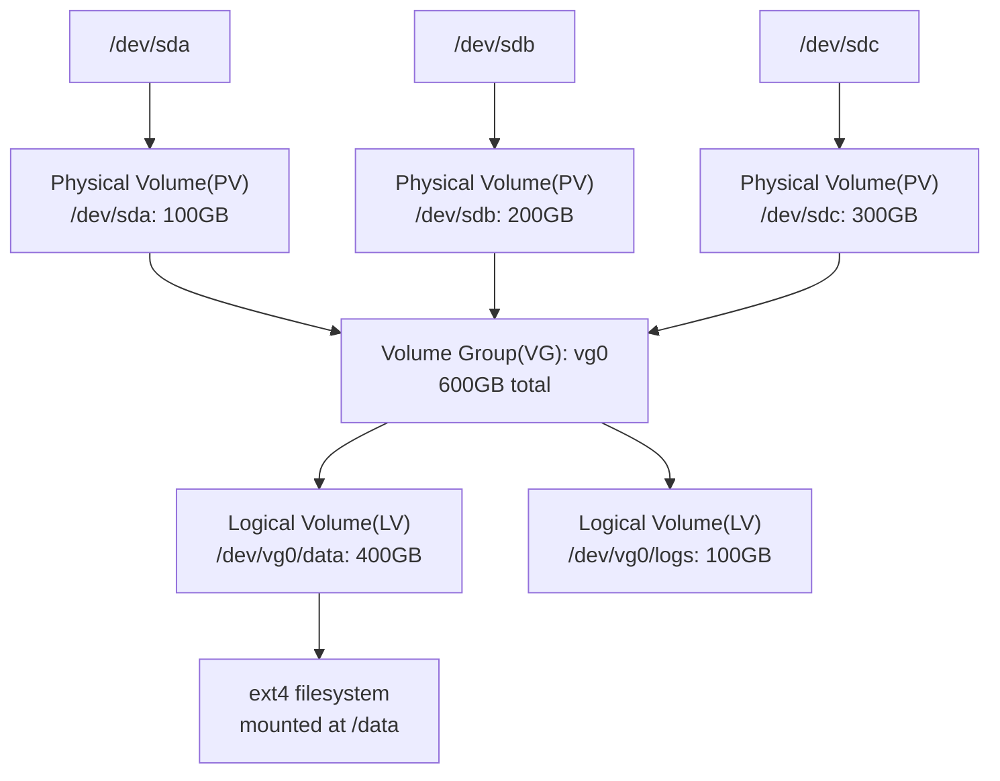

## Question

Explain LVM: the three-layer abstraction (PV, VG, LV), how it enables online resize, thin provisioning, and snapshots — and how it compares to raw partitions.

## Answer

**LVM three-layer abstraction:**



**Physical Extent (PE):** LVM divides PVs into 4MB chunks called PEs. LVs are allocated in PEs.

**Basic operations:**
```bash
# Create PV on disk
pvcreate /dev/sda /dev/sdb

# Create Volume Group
vgcreate vg0 /dev/sda /dev/sdb

# Create Logical Volume (400GB)
lvcreate -L 400G -n data vg0

# Format and mount
mkfs.ext4 /dev/vg0/data
mount /dev/vg0/data /data

# Inspect
pvs; vgs; lvs
```

**Key LVM advantages:**

**1. Online resize:**
```bash
# Extend LV by 50GB + grow filesystem (ext4)
lvextend -L +50G /dev/vg0/data
resize2fs /dev/vg0/data   # xfs: xfs_growfs /data
```

**2. Add storage online:**
```bash
pvcreate /dev/sdc
vgextend vg0 /dev/sdc     # add disk to VG without downtime
# Now extend LV into new space
```

**3. Snapshots (CoW):**
```bash
# Create snapshot of 'data' LV (10GB CoW pool)
lvcreate -L 10G -s -n data_snap /dev/vg0/data
# Mount read-only for backup
mount -o ro /dev/vg0/data_snap /mnt/backup
# Remove snapshot when done
lvremove /dev/vg0/data_snap
```

**4. Thin provisioning:**
```bash
# Create thin pool (100GB pool)
lvcreate -L 100G --thinpool thinpool vg0
# Create thin LV (over-provisioned: 200GB from 100GB pool)
lvcreate -V 200G --thin -n thinlv vg0/thinpool
```

**Striping across disks (RAID 0 for throughput):**
```bash
lvcreate -L 400G -i 2 -I 64 -n striped vg0  # stripe across 2 PVs, 64KB strip
```

## Follow-ups

- What happens if an LVM snapshot runs out of space? (Snapshot becomes invalid; original LV is unaffected.)
- How does LVM thin provisioning relate to TRIM/discard for SSDs?
- How do you move a PV's data to another disk while mounted? (`pvmove`)
