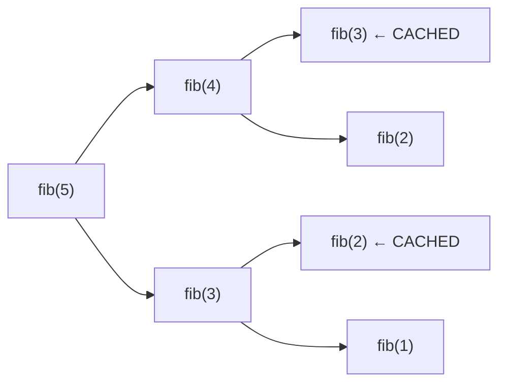

## Question

Explain the difference between top-down DP with memoization and bottom-up DP with tabulation. When is each preferred? Use the Fibonacci sequence and 0/1 Knapsack as examples.

## Answer

**Two approaches to the same idea** — avoid redundant computation by storing subproblem results.

**Top-down (memoization):**
- Write the natural recursive solution.
- Add a cache (`memo`) to store results of already-solved subproblems.
- On each call, check cache first.

```python
memo = {}
def fib(n):
    if n <= 1: return n
    if n in memo: return memo[n]
    memo[n] = fib(n-1) + fib(n-2)
    return memo[n]
```

**Bottom-up (tabulation):**
- Identify the base cases.
- Fill a table in dependency order (small subproblems first).
- No recursion, no stack overhead.

```python
def fib(n):
    dp = [0, 1]
    for i in range(2, n+1):
        dp.append(dp[-1] + dp[-2])
    return dp[n]
# Space-optimized: O(1) with just two variables
```

**Comparison:**

| | Top-Down | Bottom-Up |
|---|---|---|
| Intuition | Natural recursion + cache | Fill table in order |
| Stack risk | Yes (deep recursion) | No |
| Computes only needed | ✓ (lazy) | ✗ (all subproblems) |
| Space optimization | Harder | Easier (roll array) |
| Code complexity | Often simpler to write | Requires ordering insight |

**0/1 Knapsack — tabulation:**
`dp[i][w]` = max value using first i items with weight budget w.
```
dp[i][w] = max(dp[i-1][w],           # skip item i
               dp[i-1][w-wt[i]] + val[i])  # take item i (if w >= wt[i])
```
Space: O(n·W). Optimize to O(W) by iterating `w` backwards in a 1D array.


With memoization, `fib(3)` and `fib(2)` are computed once. Without it: exponential work.

## Follow-ups

- Explain the space optimization for LCS from O(n·m) to O(min(n,m)).
- What is "state compression" DP and when is it used (bitmask DP)?
- How do you recognize that a problem has DP structure vs divide-and-conquer?
