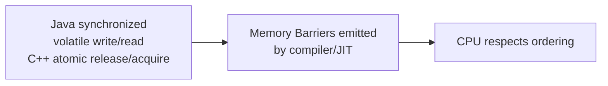

## Question

Explain why modern CPUs and compilers reorder instructions, what problems this causes for concurrent programs, and how memory barriers (fences) restore the needed ordering. Give a concrete example of a reordering that breaks correctness.

## Answer

**Why reordering happens:**

1. **CPU out-of-order execution:** Superscalar CPUs execute instructions in parallel if no data dependency exists. Instruction execution order ≠ program order.
2. **Store buffers:** CPUs write to a store buffer before main memory. Another CPU may read the old value before the store flushes.
3. **Cache coherence delays:** Write propagation across CPU caches has latency.
4. **Compiler optimizations:** The compiler reorders loads/stores for better register usage, eliminating redundant reads.

**Concrete example — Dekker's algorithm without barriers:**

```
# Thread A            # Thread B
flag_A = 1            flag_B = 1
if flag_B == 0:       if flag_A == 0:
    critical_section      critical_section
```

CPU can reorder: read `flag_B` before writing `flag_A`. Both threads see the other's flag as 0 and enter the critical section simultaneously. **Data race.**

**Memory barriers (fences):**

Barriers instruct the CPU not to reorder instructions across the barrier.

| Barrier type | Prevents |
|---|---|
| Store-store fence | Reordering two stores |
| Load-load fence | Reordering two loads |
| Store-load fence | Reordering store then load (most expensive — stall store buffer) |
| Full fence (`mfence` x86) | All reordering |

**x86 is "strongly ordered"** — stores to the same cache line appear in order. Most reorderings visible on ARM, POWER, RISC-V (weakly ordered architectures).

**Language-level mapping:**



Java `volatile` write emits a store-load barrier on x86 (`lock add [rsp], 0` or `mfence`). Go's channel operations and `sync/atomic` emit appropriate barriers.

**Why you care:** Writing concurrent code in C, Rust, or Go with custom atomics requires reasoning about memory order explicitly. In Java, the JMM abstracts this — synchronize correctly and barriers are inserted automatically.

## Follow-ups

- What is acquire-release semantics, and how does it differ from sequential consistency?
- Why is `memory_order_relaxed` in C++ atomic the fastest and what invariants does it sacrifice?
- How does the Linux kernel use `smp_mb()`, `smp_rmb()`, `smp_wmb()` barriers?
