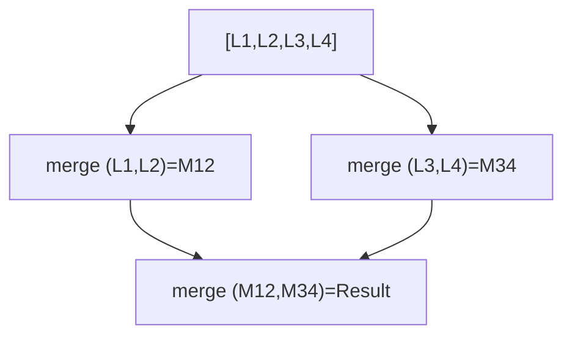

## Question

Given K sorted linked lists, merge them into one sorted list. Compare the naive approach, the divide-and-conquer approach, and the min-heap approach in terms of time and space complexity.

## Answer

**Setup:** K lists, N total elements.

**Approach 1 — Naive sequential merge:** Merge list 1 into list 2, then into list 3, etc.
- Cost: first merge O(n₁+n₂), second O(n₁+n₂+n₃), ... → O(K·N) worst case.
- Poor: repeated work.

**Approach 2 — Divide and conquer:** Pair up lists, merge pairs, repeat.
- Log₂(K) rounds, each round processes all N elements.
- Time: O(N log K). Space: O(log K) recursion stack.



**Approach 3 — Min-heap:** Insert the head of each list into a min-heap. Repeatedly extract the minimum, add it to the result, and push the next node from that list into the heap.
- Time: O(N log K) — each of N elements is pushed/popped once, heap has ≤ K elements.
- Space: O(K) for the heap.

```python
import heapq
def mergeKLists(lists):
    heap = []
    for i, node in enumerate(lists):
        if node:
            heapq.heappush(heap, (node.val, i, node))
    dummy = cur = ListNode(0)
    while heap:
        val, i, node = heapq.heappop(heap)
        cur.next = node
        cur = cur.next
        if node.next:
            heapq.heappush(heap, (node.next.val, i, node.next))
    return dummy.next
```

**Why `i` in the tuple?** Break ties when values are equal — Python can't compare `ListNode` objects directly.

**Comparison:**

| Approach | Time | Space |
|---|---|---|
| Naive sequential | O(K·N) | O(1) |
| Divide & conquer | O(N log K) | O(log K) |
| Min-heap | O(N log K) | O(K) |

Both D&C and heap are optimal. Heap is more natural for streaming inputs (when you don't have all lists upfront).

## Follow-ups

- How would you merge K sorted **files** that don't fit in memory? (External K-way merge with heap.)
- What's the complexity of the external sort merging phase?
- How does this relate to the merge step of mergesort?
