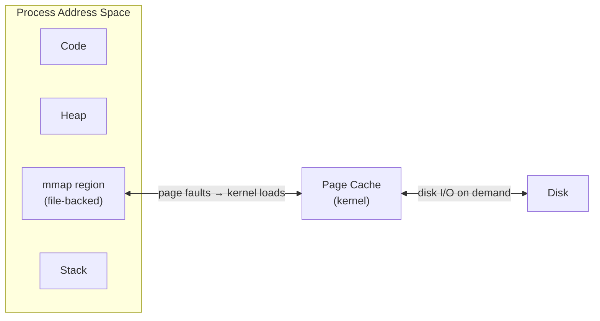

## Question

Explain `mmap()`: how it maps files into virtual memory, the tradeoffs vs `read()`/`write()`, and the specific use cases where it excels (large files, shared memory, zero-copy I/O, inter-process communication).

## Answer

**`mmap()` mechanism:**

`mmap(addr, length, prot, flags, fd, offset)` maps a file or anonymous memory into the process's virtual address space. Accessing the mapped region triggers page faults — the kernel lazily loads pages from the file into the page cache.



**`mmap` vs `read()`/`write()`:**

| | `read()`/`write()` | `mmap()` |
|---|---|---|
| Data path | Kernel page cache → user buffer (copy) | Direct page cache access (no copy) |
| CPU usage | Copy overhead | No copy; but page fault overhead |
| Random access | Seek + read | Array index — simple |
| File modification | Write to buffer, syscall | Write to memory directly |
| Suitable for | Sequential streaming | Random access, large files |

**Shared memory (IPC):**
```c
// Process A creates shared memory
fd = shm_open("/myshm", O_CREAT|O_RDWR, 0666);
ftruncate(fd, SIZE);
ptr = mmap(NULL, SIZE, PROT_READ|PROT_WRITE, MAP_SHARED, fd, 0);

// Process B maps the same name
fd = shm_open("/myshm", O_RDWR, 0666);
ptr = mmap(...MAP_SHARED...);
// Now both processes share the same pages — no copy on IPC
```

**When `mmap` wins:**
- **Random access to large files:** e.g., a 10GB database file — access any byte as an array element. OS handles prefetching.
- **Shared memory IPC:** Fastest possible IPC — no kernel intermediary, just a memory write.
- **Zero-copy:** Map a file and `send()` it — `sendfile()` is even better (kernel-only path).
- **Memory-mapped databases:** LMDB, RocksDB memory table, SQLite WAL journal.

**`mmap` pitfalls:**
- **Bus error (SIGBUS):** File truncated after mmap — accessing beyond the file end.
- **Page faults visible as latency spikes:** Unpleasant for latency-sensitive paths.
- **No `mmap` on some filesystems:** NFS, FUSE — fallback required.
- **Dirty pages written lazily:** `msync(MAP_SYNC)` or `msync(MS_SYNC)` needed for durability.

## Follow-ups

- What is the difference between `MAP_SHARED` and `MAP_PRIVATE` in terms of page table entries?
- How does `madvise(MADV_SEQUENTIAL)` help the kernel prefetch pages?
- How does LMDB (the database) use mmap as its storage engine?
