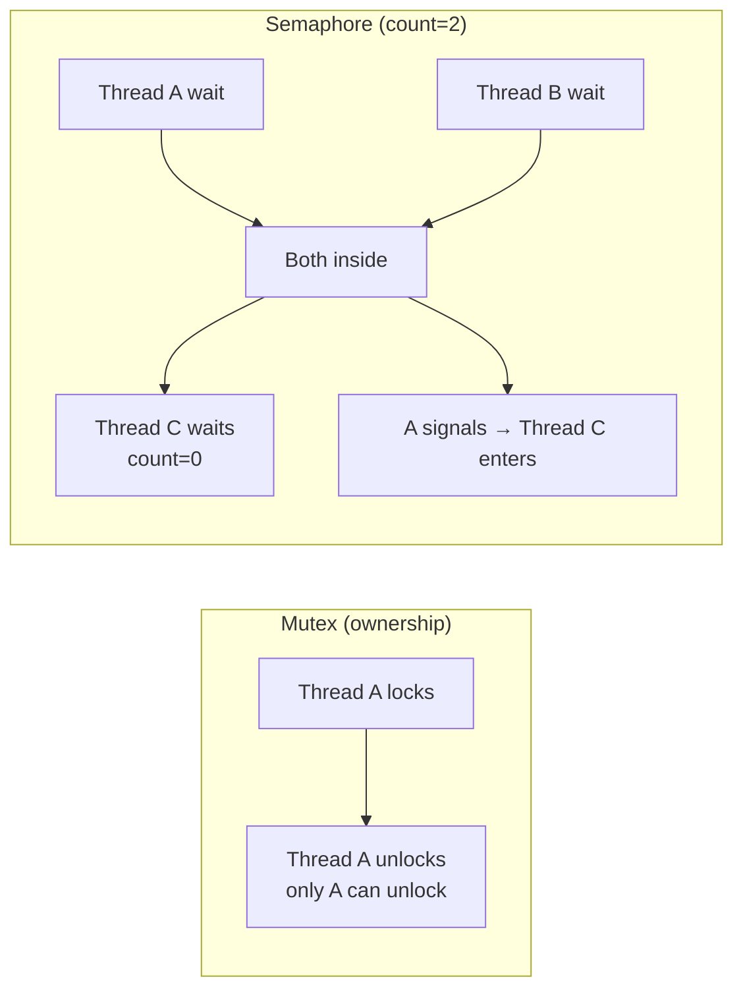

## Question

Distinguish between a mutex and a semaphore. Explain the ownership semantics, the counting vs binary distinction, and give concrete use cases where only one of them is appropriate.

## Answer

**Mutex (Mutual Exclusion Lock):**
- Binary: locked or unlocked.
- **Ownership:** only the thread that locked it can unlock it.
- Purpose: protect a critical section so only one thread executes it at a time.
- Supports priority inheritance to prevent priority inversion (important in real-time systems).

```
Thread A: mutex.lock() → critical section → mutex.unlock()
Thread B: mutex.lock() ← blocks until A unlocks
```

**Semaphore:**
- Has a non-negative integer count.
- Any thread can signal (increment) or wait (decrement).
- **No ownership** — one thread can signal what another has waited on.
- **Binary semaphore (count=1):** similar to mutex but without ownership.
- **Counting semaphore (count=N):** allows N concurrent accesses.

```
sem = Semaphore(3)  // pool of 3 resources
Thread A: sem.wait() → use resource → sem.signal()
Thread B: sem.wait() → use resource → sem.signal()
// Up to 3 threads can be inside simultaneously
```



**Key differences:**

| | Mutex | Semaphore |
|---|---|---|
| Ownership | ✓ (locker must unlock) | ✗ (anyone can signal) |
| Count | Binary (0 or 1) | Integer ≥ 0 |
| Use case | Protect critical section | Rate-limit, producer-consumer |
| Priority inheritance | Often supported | Typically not |

**When mutex only:** Protecting a shared data structure. Only the lock holder modifies it and must release it.

**When semaphore only:**
- **Signaling between threads:** Producer signals consumer that data is ready (consumer does the wait; producer does the signal — different threads).
- **Resource pooling:** Limit concurrent access to a DB connection pool of size N.
- **Ordering:** Ensure B runs after A without shared data.

**Tricky pitfall:** Using a binary semaphore as a mutex is dangerous — a different thread can "unlock" it, leading to protection failures.

## Follow-ups

- What is a reentrant (recursive) mutex and when do you need one?
- What is a condition variable, and how does it differ from a semaphore?
- What is priority inversion and how does priority inheritance in mutexes prevent it?
