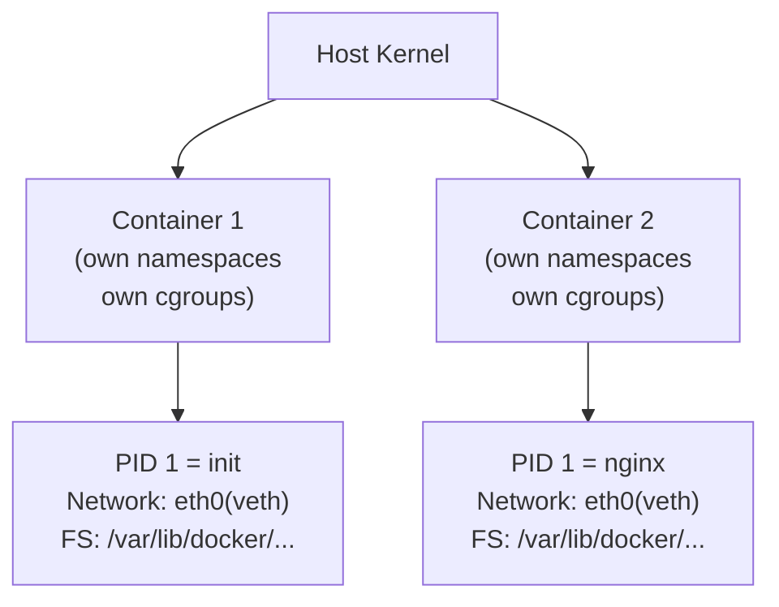

## Question

Explain the two kernel features that make containers possible: Linux namespaces (for isolation) and cgroups (for resource limits). What does each namespace type isolate, and how do cgroups v1 vs v2 differ?

## Answer

**Containers = namespaces + cgroups + copy-on-write filesystem.** No hypervisor; processes run directly on the host kernel.

**Linux Namespaces (isolation):**

| Namespace | Flag | Isolates |
|---|---|---|
| Mount | CLONE_NEWNS | Filesystem mount points — container gets its own rootfs |
| PID | CLONE_NEWPID | Process IDs — container's PID 1 is independent |
| Network | CLONE_NEWNET | Network interfaces, routing tables, iptables rules |
| UTS | CLONE_NEWUTS | Hostname and domain name |
| IPC | CLONE_NEWIPC | System V IPC, POSIX message queues |
| User | CLONE_NEWUSER | UID/GID mapping — root inside = non-root outside |
| Cgroup | CLONE_NEWCGROUP | cgroup root (containers see their own cgroup hierarchy) |
| Time | CLONE_NEWTIME | (Linux 5.6+) Boot and monotonic time offsets |



**cgroups v1:** Multiple hierarchies — each resource controller (cpu, memory, blkio) has its own hierarchy. Complex to manage; inconsistent semantics across controllers.

**cgroups v2 (unified hierarchy):** Single hierarchy for all controllers. All processes at the same level. Better delegation. Kubernetes migrated to v2 from K8s 1.25+.

**Key cgroup v2 controls:**
```bash
# CPU throttling
echo "50000 100000" > /sys/fs/cgroup/mycontainer/cpu.max  # 50% CPU

# Memory limit + OOM kill
echo "512M" > /sys/fs/cgroup/mycontainer/memory.max

# Inspect container's cgroup from inside:
cat /proc/self/cgroup
```

**Container creation (simplified `unshare`):**
```bash
unshare --mount --pid --net --uts --ipc --fork bash
# Now in new namespaces; this bash is PID 1 in its PID namespace
```

**seccomp:** Syscall filtering — container processes are restricted to an allowlist of syscalls. Docker's default seccomp profile blocks ~44 syscalls (e.g., `reboot`, `ptrace`).

## Follow-ups

- What is "rootless containers" and how do user namespaces enable it?
- Why do containers share the host kernel — what attack surface does that leave?
- How does `docker exec` attach to an existing container's namespaces?
