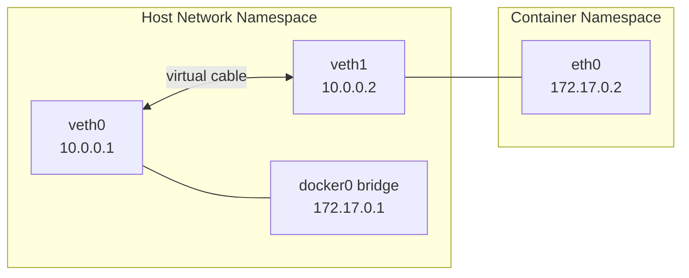

## Question

Explain network namespaces: how each container gets an isolated network stack, the veth pair mechanism connecting namespace to host, the docker0 bridge, and how Kubernetes pod networking works at the kernel level.

## Answer

**Network namespace:** An isolated copy of the Linux network stack: network interfaces, routing tables, iptables rules, sockets, `/proc/net`. Processes in different network namespaces cannot communicate without explicit connections.

**Creating a network namespace:**
```bash
ip netns add myns                      # create
ip netns exec myns ip link list        # run command inside
ip netns exec myns bash                # open shell inside

# Inside: only 'lo' interface exists — isolated
```

**veth pair — virtual ethernet cable:**
```bash
# Create veth pair
ip link add veth0 type veth peer name veth1

# Move veth1 into namespace
ip link set veth1 netns myns

# Configure IPs
ip addr add 10.0.0.1/24 dev veth0
ip netns exec myns ip addr add 10.0.0.2/24 dev veth1

# Bring up
ip link set veth0 up
ip netns exec myns ip link set veth1 up

# Now host can reach namespace: ping 10.0.0.2
```



**Docker networking:**
1. Docker creates `docker0` Linux bridge (default 172.17.0.1/16).
2. Per container: creates veth pair; moves one end into container namespace as `eth0`; connects other end to `docker0`.
3. iptables MASQUERADE: container traffic NATed to host IP for external access.
4. iptables DNAT: published ports mapped from host → container.

**Kubernetes pod networking:**
- Each pod gets its own network namespace.
- All containers in a pod share one namespace (via `pause` container).
- Nodes run a CNI plugin (Flannel, Calico, Cilium) that sets up cross-node routing.
- Pods get unique IPs routable across the cluster.

**CNI (Container Network Interface):** Plugin interface. When pod is scheduled, kubelet calls CNI plugin to: allocate IP, create veth pair, connect to node network, configure routing.

```bash
# Inspect pod network namespace from host:
PID=$(docker inspect --format '{{.State.Pid}}' <container_id>)
nsenter -t $PID -n ip addr   # enter network namespace of container
```

## Follow-ups

- What is the `pause` container in Kubernetes and why does it exist?
- How does Flannel implement cross-node pod networking (VXLAN overlay)?
- How does Calico use BGP instead of overlay networks for pod routing?
