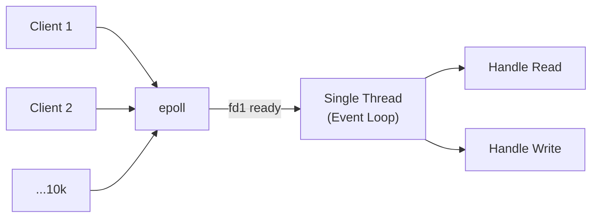

## Question

Explain how non-blocking I/O works at the OS level (select/poll/epoll), how Java NIO uses Selectors, and how Node.js's libuv uses the same primitives — enabling high concurrency without proportional threads.

## Answer

**The blocking I/O problem:** With `read()` (blocking), a thread sits idle waiting for data. To handle 10k concurrent connections, you need 10k threads — expensive.

**Non-blocking I/O model:**

1. Set socket to non-blocking mode.
2. Ask the OS to watch multiple sockets and notify when any is ready.
3. A single thread handles thousands of connections.

**OS primitives:**

| API | OS | Notes |
|---|---|---|
| `select` | All UNIX | Limited to 1024 fds, O(n) scan |
| `poll` | POSIX | No fd limit, O(n) scan |
| `epoll` | Linux | O(1) readiness, edge/level triggered |
| `kqueue` | macOS/BSD | Like epoll |
| IOCP | Windows | Completion ports |

**`epoll` flow:**
```c
int epfd = epoll_create1(0);
epoll_ctl(epfd, EPOLL_CTL_ADD, sockfd, &event);  // register socket
while (true) {
    int n = epoll_wait(epfd, events, MAX_EVENTS, timeout);  // block until ready
    for (int i = 0; i < n; i++) {
        handle(events[i].data.fd);  // only ready fds
    }
}
```

**Java NIO Selector:**
```java
Selector selector = Selector.open();
channel.configureBlocking(false);
channel.register(selector, SelectionKey.OP_READ);

while (true) {
    selector.select();   // blocks until at least one channel ready
    Iterator<SelectionKey> keys = selector.selectedKeys().iterator();
    while (keys.hasNext()) {
        SelectionKey key = keys.next();
        if (key.isReadable()) { handleRead(key); }
        keys.remove();
    }
}
```

Java NIO wraps `epoll` on Linux. Netty and Vert.x build high-performance servers on top.



**Node.js / libuv:**
- Single JS thread runs event callbacks.
- libuv uses `epoll`/`kqueue`/IOCP for network I/O.
- File I/O (no async OS API on all platforms) uses a thread pool (4 threads by default).
- Timer events (setTimeout) are managed by libuv's timer heap.

**Key insight:** The event loop thread is never blocked (other than in `epoll_wait`). All I/O operations are dispatched to the OS; the thread processes completions when they arrive.

## Follow-ups

- What is the difference between edge-triggered and level-triggered `epoll`?
- How does Java's `AsynchronousSocketChannel` (NIO.2) differ from NIO Selector-based channels?
- Why doesn't Node.js use `epoll` for file I/O? (Linux `aio` has limitations; libuv uses a thread pool instead.)
