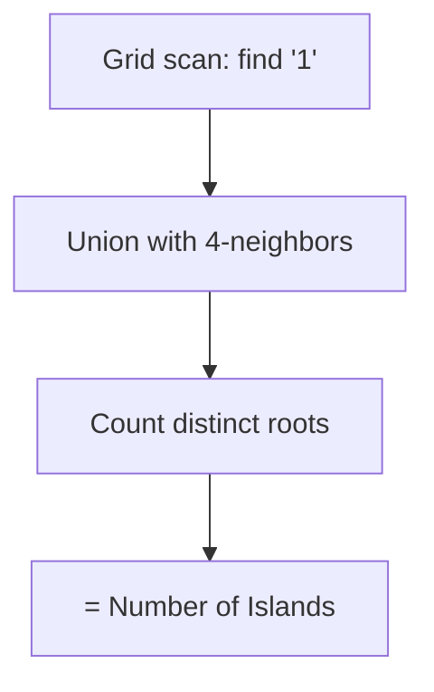

## Question

Given a 2D grid of '1' (land) and '0' (water), count the number of islands. Solve it three ways — DFS, BFS, and Union-Find — and discuss the tradeoffs.

## Answer

**DFS approach:**
Whenever you hit a '1', increment count, then DFS to mark all connected land as visited ('0' or a separate visited array).

```python
def numIslands(grid):
    count = 0
    for r in range(len(grid)):
        for c in range(len(grid[0])):
            if grid[r][c] == '1':
                count += 1
                dfs(grid, r, c)
    return count

def dfs(grid, r, c):
    if r < 0 or r >= len(grid) or c < 0 or c >= len(grid[0]) or grid[r][c] != '1':
        return
    grid[r][c] = '0'   # mark visited
    for dr, dc in [(0,1),(0,-1),(1,0),(-1,0)]:
        dfs(grid, r+dr, c+dc)
```

Time: O(m·n). Space: O(m·n) call stack worst case (snake-shaped island).

**BFS approach:** Replace recursion with a queue. Same time and space complexity. Avoids stack overflow for large grids — preferred in production.

**Union-Find approach:**
Flatten grid to 1D index = r × cols + c. For each '1' cell, union with '1' neighbors. The answer is the count of distinct roots for all '1' cells.



**Tradeoffs:**

| Approach | Time | Space | Notes |
|---|---|---|---|
| DFS | O(m·n) | O(m·n) stack | Simple, mutates grid |
| BFS | O(m·n) | O(min(m,n)) queue | Safer for deep grids |
| Union-Find | O(m·n·α) | O(m·n) | Better for dynamic updates |

**Union-Find shines** when the grid changes dynamically: adding land cells and querying island count after each addition — UF handles incremental unions. DFS/BFS would require re-scanning.

**Variant:** Number of distinct islands (shape matters, not just count) — use DFS path signature for hashing.

## Follow-ups

- How do you count the area of the largest island?
- How does the problem change if islands can be connected diagonally?
- If cells stream in one at a time, how do you efficiently maintain the island count? (Union-Find with rollback or persistent UF.)
