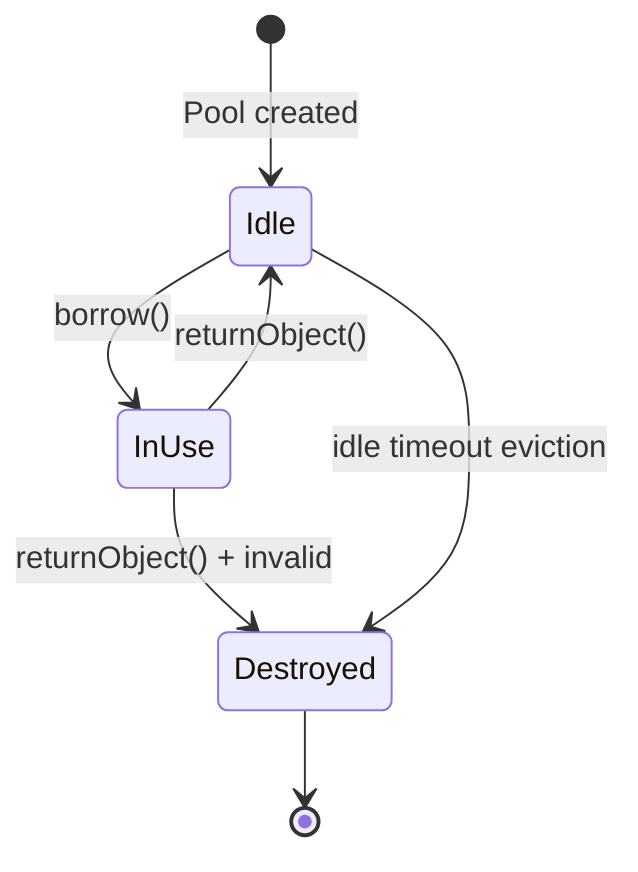

## Question

Implement a thread-safe object pool (e.g., a database connection pool). Walk through the borrow/return lifecycle, handling of exhaustion, validation of stale objects, and eviction of idle objects.

## Answer

**Object pool:** Pre-creates expensive objects (DB connections, parsers, buffers). Clients borrow an object, use it, return it. Avoids per-request creation cost.

**Core implementation using `BlockingQueue`:**

```java
public class ObjectPool<T> {
    private final BlockingQueue<T> pool;
    private final Supplier<T> factory;
    private final Consumer<T> validator;

    public ObjectPool(int size, Supplier<T> factory, Consumer<T> validator) {
        this.factory = factory;
        this.validator = validator;
        this.pool = new ArrayBlockingQueue<>(size);
        for (int i = 0; i < size; i++) pool.offer(factory.get());
    }

    public T borrow(long timeout, TimeUnit unit) throws Exception {
        T obj = pool.poll(timeout, unit);
        if (obj == null) throw new TimeoutException("Pool exhausted");
        if (!isValid(obj)) {
            obj.close();           // discard stale object
            obj = factory.get();   // create fresh one
        }
        return obj;
    }

    public void returnObject(T obj) {
        if (isValid(obj)) pool.offer(obj);
        else obj.close();          // discard broken object
    }
}
```

**Lifecycle:**



**Handling exhaustion:**
1. **Block with timeout:** `pool.poll(timeout, unit)` — client waits up to N ms.
2. **Fail fast:** `pool.poll()` (no wait) — throw exception immediately.
3. **Grow dynamically:** Create new object if pool empty (up to max; never shrink below min).

**Validation:**
- **Before borrow:** Test if object is still usable (e.g., `connection.isValid(1)`).
- **Before return:** If object is in error state, discard rather than returning to pool.

**Idle eviction:**
A background thread periodically checks idle objects older than a TTL and closes them. Prevents stale connections piling up.

**Production alternatives:**
- **HikariCP** (JDBC): fastest Java connection pool. Uses an intrinsic lock + custom linked list for O(1) borrow/return.
- **Apache Commons Pool2:** Generic object pool with lifecycle listeners.
- **Netty's `RecyclerObjectPool`:** Stack-per-thread + cross-thread stealing for minimal contention.

## Follow-ups

- How does HikariCP avoid contention better than a `BlockingQueue`-based pool?
- What is "connection validation" and why does it help with firewall-dropped idle connections?
- How do you size a JDBC connection pool? (Typically: `(CPU cores × 2) + effective_spindle_count`.)
