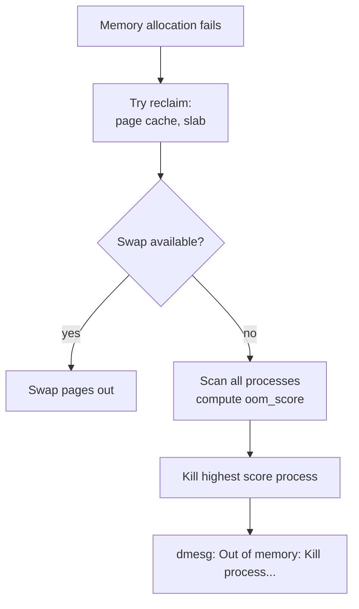

## Question

Explain the Linux OOM (Out of Memory) killer: when it's invoked, how it scores processes to choose a victim, how to influence the score, and how production services prevent OOM kills.

## Answer

**When OOM killer runs:** When the kernel cannot satisfy a memory allocation request and there's no swap space to reclaim. The kernel exhausts all other reclamation options (page cache, reclaimable kernel memory) before invoking the OOM killer.

**How it selects a victim:**

Each process has an `oom_score` (0-1000). The kernel chooses the process with the highest score (most "deserving" of death). Score is roughly proportional to memory usage relative to system RAM.

```
oom_score ≈ (process_rss / total_ram) × 1000 + oom_score_adj
```

```bash
# Check current OOM score
cat /proc/<pid>/oom_score

# Adjustment value (-1000 to 1000)
cat /proc/<pid>/oom_score_adj
```

**`oom_score_adj` adjustments:**
- `-1000` → completely exempt from OOM killing (kernel threads, systemd).
- `1000` → first to be killed.
- `0` → default; let score be computed naturally.

**Protecting critical services:**
```bash
# Protect a critical process (e.g., database)
echo -1000 > /proc/$(pgrep postgres)/oom_score_adj

# Or in systemd unit:
[Service]
OOMScoreAdjust=-1000
```

**cgroups memory limits:** With cgroup v2 `memory.max`, a cgroup OOM kill targets only processes within the cgroup, not system-wide. Kubernetes uses this — container OOM kills stay contained within the pod.



**Kubernetes OOM:** When a container exceeds its memory limit, it gets a cgroup OOM kill. The pod's `OOMKilled` status is set. K8s `kubectl describe pod` shows `OOMKilled: true` in `lastState.terminated.reason`.

**`vm.overcommit_memory`:** Controls whether the kernel allows allocations beyond physical RAM.
- `0` (default): heuristic — allows some overcommit.
- `1`: always allow (dangerous — enables OOM killer to fire later).
- `2`: never overcommit (allocation fails early if over `swap + overcommit_ratio × RAM`).

## Follow-ups

- How do you diagnose an OOM kill after the fact? (`dmesg | grep -i 'oom'`, `/var/log/syslog`)
- What is "memory pressure" and how does the kernel's LRU page reclaim work?
- How does huge page allocation interact with OOM? (Huge page allocations require contiguous memory; may OOM even with plenty of regular pages.)
