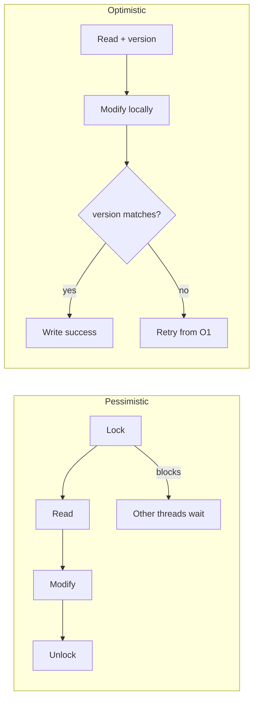

## Question

Compare optimistic and pessimistic locking strategies — in both application code (CAS, versioning) and databases (SELECT FOR UPDATE vs version column). When does each shine and when does it fail?

## Answer

**Pessimistic locking:** Assume conflicts are likely. Lock the resource before accessing it, hold it through the operation, release after.

```sql
-- Database: exclusive row lock
BEGIN;
SELECT * FROM accounts WHERE id=1 FOR UPDATE;  -- blocks other writers
UPDATE accounts SET balance = balance - 100 WHERE id=1;
COMMIT;
```

**Optimistic locking:** Assume conflicts are rare. Read without locking. Before writing, verify nothing changed (version check). Retry if it did.

```sql
-- Database: version column approach
SELECT balance, version FROM accounts WHERE id=1;
-- (in application: compute new_balance)
UPDATE accounts SET balance=new_balance, version=version+1
WHERE id=1 AND version=read_version;
-- rows_affected == 0 → conflict, retry
```



**When pessimistic wins:**
- High contention — many writers → optimistic causes many retries (wasted work).
- Long transactions where another writer is almost certain to conflict.
- When you can't retry (e.g., side effects like sending emails mid-transaction).

**When optimistic wins:**
- Low contention — conflicts rare → no lock overhead on the common path.
- Read-heavy workloads — readers don't block.
- Distributed systems where locks are expensive (e.g., across microservices).
- Stateless services — easy to retry.

**Application-level CAS (in-memory):**
Java's `AtomicInteger.compareAndSet(expected, new)` — the lock-free implementation of optimistic locking at the CPU instruction level.

**JPA/Hibernate optimistic locking:**
```java
@Entity
public class Account {
    @Version
    private Long version;  // auto-managed by Hibernate
}
// Hibernate throws OptimisticLockException on version mismatch
```

**Tradeoff summary:**

| | Pessimistic | Optimistic |
|---|---|---|
| Contention assumption | High | Low |
| Throughput under low contention | Lower | Higher |
| Throughput under high contention | Higher | Lower (retry storms) |
| Deadlock risk | Yes | No |
| Starvation risk | Yes | Possible (infinite retries) |

## Follow-ups

- How does MVCC (Multi-Version Concurrency Control) in PostgreSQL implement optimistic-like reads?
- What is a "retry storm" and how do you mitigate it with jitter?
- How does the Hibernate `@Version` annotation handle the `OptimisticLockException`?
