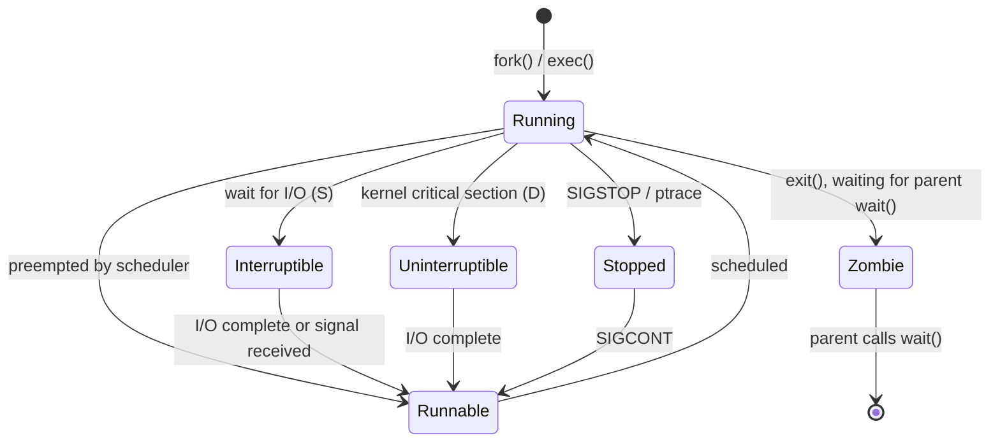

## Question

Walk through the Linux process state machine: all the states a process can be in, the transitions between them, and what each state means practically. How do you see these states with common tools?

## Answer

**Linux process states:**



**States (as seen in `ps`, `top`, `htop`):**

| Code | State | Meaning |
|---|---|---|
| `R` | Running/Runnable | On CPU or ready to run |
| `S` | Interruptible sleep | Waiting for event; responds to signals |
| `D` | Uninterruptible sleep | In kernel, cannot be interrupted (disk I/O, NFS) |
| `T` | Stopped | Paused (SIGSTOP, debugger breakpoint) |
| `Z` | Zombie | Exited but not yet reaped by parent |
| `I` | Idle | Kernel idle thread |

**Interruptible (`S`) vs Uninterruptible (`D`):**
- `S`: process wakes up if a signal arrives (e.g., waiting on socket recv — SIGINT can interrupt it).
- `D`: process cannot be interrupted even by SIGKILL. Happens during disk I/O, NFS mounts, device driver critical sections. A stuck `D` state process (often called a "zombie disk wait") usually means I/O subsystem problems.

**Zombie (`Z`):**
A process has exited but its parent hasn't called `wait()` to collect the exit code. The process table entry persists (minimal — just PID, exit code). If a process accumulates many zombies, it may exhaust PIDs. Fix: ensure parent calls `wait()` or `waitpid()`. Orphaned zombies get reparented to `init`/`systemd` which automatically reaps them.

**Viewing states:**
```bash
ps aux        # STAT column shows state + flags (e.g., Ss = sleeping session leader)
top           # S column
cat /proc/<pid>/status | grep State
ls /proc/<pid>/wchan  # what kernel function a D-state process is waiting in
```

**`+` modifier:** `S+` = process is in foreground process group. `<` = high priority (nice < 0). `N` = low priority.

## Follow-ups

- A process is stuck in `D` state — how do you diagnose and potentially recover? (`cat /proc/<pid>/wchan`, check dmesg, iotop, then consider rebooting if NFS hung.)
- What happens to child processes when a parent exits before they do? (Reparented to PID 1.)
- How does `ptrace` place a process in `T` state, and how does `gdb` use this?
