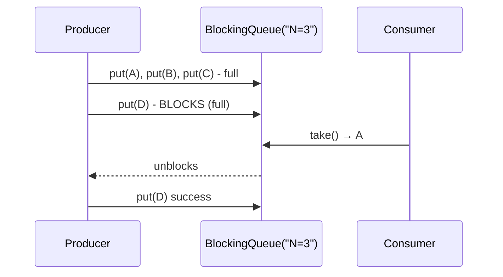

## Question

The producer-consumer problem is foundational. Walk through the bounded buffer variant and implement it using three approaches: semaphores, condition variables, and Java `BlockingQueue`. What invariants must each maintain?

## Answer

**Problem:** Producers add items to a shared buffer; consumers remove them. Buffer has finite capacity N. Producers must wait when full; consumers must wait when empty.

**Invariants:**
1. Buffer never exceeds capacity N.
2. Consumers never consume from an empty buffer.
3. No lost updates or corrupted items.

**Implementation 1 — Semaphores:**
```python
empty = Semaphore(N)   # counts empty slots (initially N)
full  = Semaphore(0)   # counts full slots (initially 0)
mutex = Semaphore(1)   # protects buffer

def producer():
    while True:
        item = produce()
        empty.wait()       # wait for empty slot
        mutex.wait()
        buffer.append(item)
        mutex.signal()
        full.signal()      # signal full slot

def consumer():
    while True:
        full.wait()        # wait for full slot
        mutex.wait()
        item = buffer.pop()
        mutex.signal()
        empty.signal()     # signal empty slot
        consume(item)
```

**Why empty.wait() BEFORE mutex.wait()?** If consumer holds mutex and calls full.wait() (buffer empty) → deadlock (producer can't acquire mutex to add item). Always acquire resource semaphores before the mutex.

**Implementation 2 — Condition variables:**
```java
ReentrantLock lock = new ReentrantLock();
Condition notFull  = lock.newCondition();
Condition notEmpty = lock.newCondition();
Queue<Item> buffer = new LinkedList<>();

void produce(Item item) throws InterruptedException {
    lock.lock();
    try {
        while (buffer.size() == N) notFull.await();
        buffer.add(item);
        notEmpty.signal();
    } finally { lock.unlock(); }
}

Item consume() throws InterruptedException {
    lock.lock();
    try {
        while (buffer.isEmpty()) notEmpty.await();
        Item item = buffer.poll();
        notFull.signal();
        return item;
    } finally { lock.unlock(); }
}
```

**Implementation 3 — Java `BlockingQueue` (simplest):**
```java
BlockingQueue<Item> queue = new ArrayBlockingQueue<>(N);
// Producer:
queue.put(item);       // blocks if full
// Consumer:
Item item = queue.take();  // blocks if empty
```

All synchronization is encapsulated. This is the recommended production approach.



## Follow-ups

- How would you implement a multi-producer, multi-consumer bounded buffer?
- What happens if the producer is much faster than the consumer? (Buffer fills → producer blocks → backpressure. If unbounded → OOM.)
- How does the Disruptor pattern improve on the BlockingQueue for ultra-high throughput?
