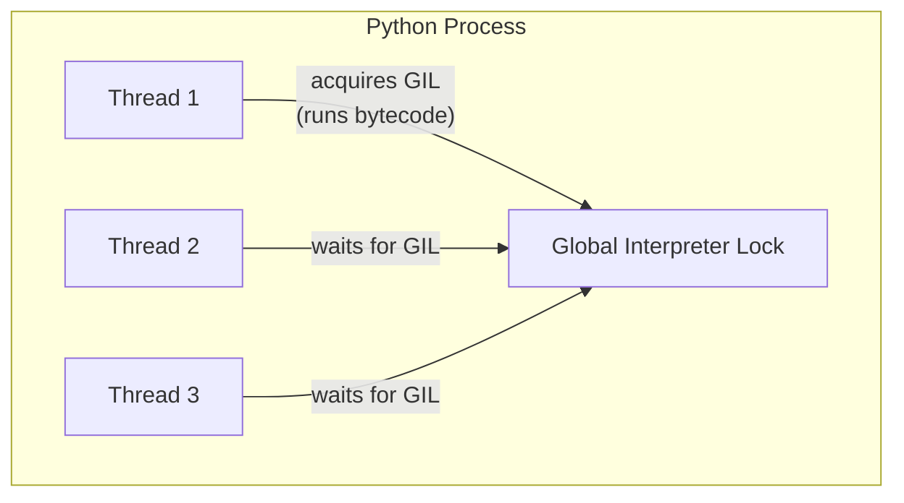

## Question

Explain the Python Global Interpreter Lock (GIL): what it protects, why it exists, what it prevents, and the workarounds for CPU-bound vs I/O-bound parallelism.

## Answer

**What the GIL is:** A mutex inside CPython that ensures only one thread executes Python bytecode at a time — even on multi-core machines.

**Why it exists:** CPython's memory management (reference counting) is not thread-safe. The GIL protects `PyObject` reference counts from races. Without it, two threads decrementing the same object's refcount could both see 1 → both free the object → double-free crash.



**What the GIL prevents:** True CPU parallelism for Python threads. Two Python threads on a dual-core machine do NOT run in parallel — one always waits.

**What the GIL does NOT prevent:**
- I/O-bound concurrency: The GIL is released during I/O syscalls (`read`, `recv`, `sleep`). Multiple threads can overlap I/O waiting.
- C extensions releasing the GIL: NumPy, OpenCV, and most scientific libraries release the GIL during heavy computation — true parallelism for those operations.

**GIL release mechanism:** Every 100 bytecode instructions (Python 2) or after a timeout (~5ms in Python 3), the GIL is released to allow another thread to run. This is cooperative within Python code, preemptive at the OS level.

**Workarounds:**

| Problem | Solution |
|---|---|
| I/O-bound concurrency | `threading` or `asyncio` — GIL released during I/O |
| CPU-bound parallelism | `multiprocessing` — separate processes, each has its own GIL |
| Numeric computation | NumPy/SciPy (release GIL) or Cython with `nogil` |
| Future | Free-threaded CPython (PEP 703, Python 3.13 experimental) |

**`multiprocessing` vs `threading`:**
```python
# CPU-bound: use multiprocessing
from multiprocessing import Pool
with Pool(4) as p:
    results = p.map(cpu_heavy_fn, data)

# I/O-bound: use threading or asyncio
import threading
threads = [threading.Thread(target=io_fn, args=(url,)) for url in urls]
```

**PEP 703 (Python 3.13+):** Optional "free-threaded" build removes the GIL. Still experimental; many C extensions must be updated.

## Follow-ups

- Why doesn't PyPy have the same GIL problem? (PyPy has its own GIL — different memory manager but same constraint.)
- How does `concurrent.futures.ProcessPoolExecutor` manage worker processes?
- If the GIL releases every 5ms, can two Python threads still have a race condition? (Yes — at bytecode boundaries, not at machine instruction boundaries.)
