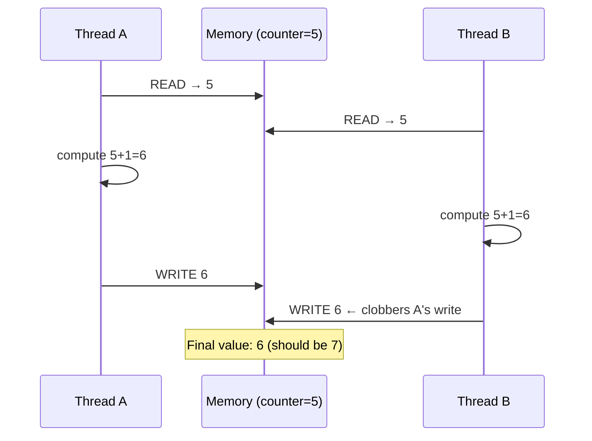

## Question

Define race condition precisely, give a concrete example showing the interleaving that causes it, and walk through the four strategies to eliminate races: confinement, immutability, synchronization, and lock-free atomics.

## Answer

**Definition:** A race condition occurs when the correctness of a program depends on the relative timing or interleaving of threads. The program produces different results on different runs.

**Example — non-atomic increment:**
```java
// Shared: int counter = 0;
// Thread A and B both run: counter++;
// Which compiles to: read → increment → write (3 steps)

Thread A reads counter = 5
Thread B reads counter = 5
Thread A writes 6
Thread B writes 6   ← Lost update! Expected 7
```



**Strategy 1 — Thread confinement:** Only one thread ever accesses the data. No synchronization needed. Examples: thread-local variables, actor model (each actor owns its state).

**Strategy 2 — Immutability:** Data that never changes can be safely shared. Make objects immutable (Java `final` fields, Rust `&T` references). No locks needed.

**Strategy 3 — Synchronization (locks):** Use a mutex to make the critical section atomic. Cost: contention, potential deadlocks.

```java
synchronized(lock) {
    counter++;  // now atomic
}
```

**Strategy 4 — Lock-free atomics:** Use hardware-supported atomic operations (CAS, fetch-and-add). Faster than locks when contention is low.

```java
AtomicInteger counter = new AtomicInteger(0);
counter.incrementAndGet();  // atomic, no lock
```

**Detecting races:**
- **ThreadSanitizer (TSan):** compiler instrumentation that detects data races at runtime (Go, C/C++, Rust).
- **Java:** `java.util.concurrent` tools, code review, stress tests with `-Djava.util.concurrent.ForkJoinPool.common.parallelism`.
- **Code review heuristics:** shared mutable state + multiple threads = suspect.

## Follow-ups

- What is a data race vs a race condition? (Data race: unsynchronized access to shared memory. Race condition: timing-dependent bug — can exist without a data race.)
- How does Go's race detector work?
- Explain the "check-then-act" compound race: `if (map.containsKey(k)) { map.get(k) }` in a concurrent context.
