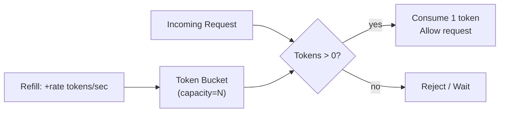

## Question

Implement a thread-safe rate limiter supporting N requests per second. Walk through the token bucket algorithm, then show how to make it thread-safe using atomics (CAS) and finally how Guava's `RateLimiter` works.

## Answer

**Token bucket algorithm:**

A bucket holds up to `N` tokens. Tokens refill at a fixed rate. Each request consumes one token. If bucket is empty, request is rejected or waits.



**Naive implementation (not thread-safe):**
```python
class TokenBucket:
    def __init__(self, rate, capacity):
        self.tokens = capacity
        self.rate = rate
        self.last_refill = time.time()
    
    def allow(self):
        now = time.time()
        elapsed = now - self.last_refill
        self.tokens = min(self.capacity, self.tokens + elapsed * self.rate)
        self.last_refill = now
        if self.tokens >= 1:
            self.tokens -= 1
            return True
        return False
```

**Thread-safe with a lock:**
```python
self._lock = threading.Lock()
def allow(self):
    with self._lock:
        # same logic above
```

**Thread-safe with CAS (lock-free, Java):**
Store `(tokens, last_refill_nanos)` in an `AtomicLong` (pack both into 64 bits if tokens fit in 32 bits). CAS the pair atomically:
```java
long packed = state.get();
long tokens = unpackTokens(packed);
long lastTime = unpackTime(packed);
long newTokens = min(capacity, tokens + rate * elapsed);
long newPacked = pack(newTokens - 1, now);
if (state.compareAndSet(packed, newPacked)) return true;
// else retry
```

**Guava `RateLimiter`:**
- Token bucket with smooth refill (SmoothRateLimiter).
- `acquire()` blocks until token available — does NOT reject, it throttles.
- `tryAcquire(timeout)` — fail fast with timeout.
- Handles bursting: `create(rate, warmupPeriod)` allows initial burst.
- Internally uses `synchronized` — simple but not lock-free.

**Sliding window counter (alternative):**
```
window = {}
for each request at time T:
    count = sum(window[t] for t in (T-1s, T])
    if count < limit: allow, window[T]++
    else: reject
```
More accurate than token bucket at window boundaries. Requires O(requests) memory.

## Follow-ups

- How does a distributed rate limiter work across multiple nodes? (Redis INCR + EXPIRE, or Lua script for atomicity.)
- What is the leaky bucket algorithm and how does it differ from token bucket?
- How does `tryAcquire(1, 0, NANOSECONDS)` on Guava's RateLimiter implement non-blocking behavior?
