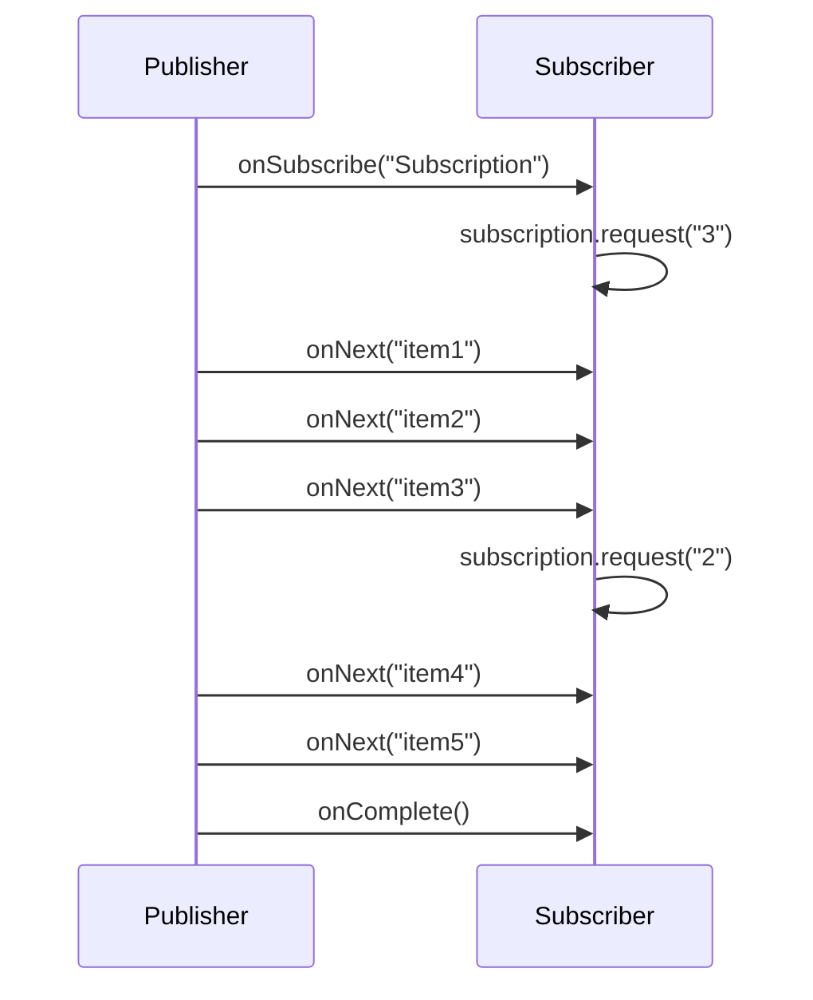

## Question

Explain reactive programming: what problem it solves, the Reactive Streams specification (Publisher/Subscriber/Subscription/Processor), and the backpressure mechanism. When should you choose reactive over imperative async?

## Answer

**Problem reactive programming solves:**

In push-based systems (callbacks, listeners), a fast producer can overwhelm a slow consumer. Traditional thread-per-request models block expensive OS threads waiting for I/O. Reactive programming provides:
- Non-blocking I/O with minimal threads.
- Backpressure — consumers signal how much data they can handle.

**Reactive Streams Specification (4 interfaces):**

- **Publisher:** Produces items. Respects demand from subscribers.
- **Subscriber:** Requests items via `subscription.request(n)`. Called with `onNext`, `onError`, `onComplete`.
- **Subscription:** The link. `request(n)` signals demand; `cancel()` stops.
- **Processor:** Both Publisher and Subscriber — a transform stage.

**Backpressure:** The subscriber controls the flow rate by calling `request(n)`. The publisher must not send more than requested. This prevents buffer overflow.

**Backpressure strategies when buffer fills:**
- **Buffer:** Accept items into a bounded buffer; error if full.
- **Drop:** Silently drop items that don't fit.
- **Latest:** Keep only the most recent item, overwrite on overflow.
- **Error:** Signal error to upstream.

**Implementations:**
- **Project Reactor (Spring WebFlux):** `Mono<T>` (0-1 item), `Flux<T>` (0-N items).
- **RxJava:** `Observable`, `Flowable` (with backpressure), `Single`.
- **Akka Streams:** Graph-based DSL.

**When reactive wins:**
- High I/O concurrency with limited threads (microservices doing many downstream calls).
- Streaming data pipelines (event streams, SSE, WebSocket).
- Systems where thread-per-request would exhaust thread pools (100k concurrent connections).

**When imperative is better:**
- Simple CRUD — reactive adds complexity without benefit.
- CPU-bound work — reactive doesn't help; use parallel streams or ForkJoinPool.
- Debugging is much harder in reactive (stack traces span thread boundaries, reactor operators).
- Team unfamiliarity — reactive has a steep learning curve.

## Follow-ups

- What is Project Loom's impact on reactive programming? (Virtual threads make blocking cheap → reactive less necessary.)
- How does `flatMap` vs `concatMap` differ in Project Reactor for ordering?
- What is the difference between hot and cold publishers?
