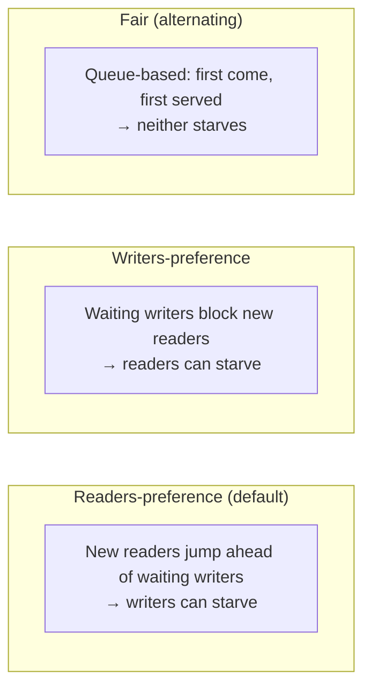

## Question

Describe the readers-writers problem, the three classic variants (readers-preference, writers-preference, fair), and how `ReadWriteLock` implements each. When do you use RWLock over a plain mutex?

## Answer

**Problem:** Multiple threads read shared data; some threads write. Multiple simultaneous reads are safe, but writes need exclusive access.

**Constraints:**
- Multiple readers can proceed simultaneously (no modification).
- Writers need exclusive access (no readers, no other writers).

**Three variants:**



**Implementation — readers-preference:**

```python
read_count = 0
read_mutex = Mutex()   # protect read_count
write_lock = Mutex()   # exclusive for writers

# Reader
read_mutex.lock()
read_count += 1
if read_count == 1: write_lock.lock()  # first reader blocks writers
read_mutex.unlock()
# ... read ...
read_mutex.lock()
read_count -= 1
if read_count == 0: write_lock.unlock()  # last reader releases
read_mutex.unlock()

# Writer
write_lock.lock()
# ... write ...
write_lock.unlock()
```

**Java `ReentrantReadWriteLock`:** Supports both modes + optional fairness (`new ReentrantReadWriteLock(true)`). Fair mode uses a queue — no thread starves. Non-fair (default) is faster but can starve writers.

**Lock downgrading:** In Java, you can downgrade from write lock to read lock (acquire read, release write) but NOT upgrade from read to write (would deadlock if two readers try to upgrade).

**When to use RWLock over plain Mutex:**

Use RWLock when:
- Reads heavily outnumber writes (≥ 10:1 ratio).
- Read operations are non-trivial in duration.

Avoid RWLock when:
- Writes are frequent — the overhead of RWLock bookkeeping outweighs the benefit.
- Critical sections are very short — plain mutex with low contention is faster (simpler CAS path).
- Cache line false sharing between readers and writer metadata is a bottleneck.

**Read-write performance:** At low reader counts, RWLock is often slower than a mutex due to metadata overhead. Benefit only appears with many concurrent readers.

## Follow-ups

- How does Linux's `pthread_rwlock` implement fairness?
- Explain "lock upgrading" — why it leads to deadlock and how to safely handle it.
- How does Java's `StampedLock` improve on `ReadWriteLock` with optimistic reads?
