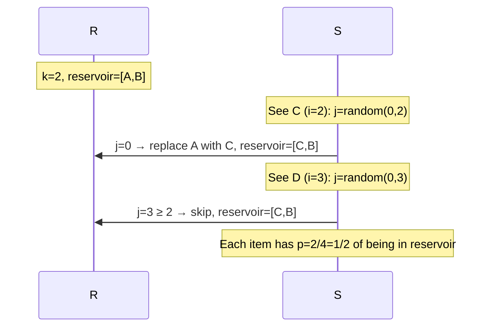

## Question

You are reading a stream of items one at a time and the total count is unknown. At any point, you must be able to return a uniformly random sample of size K from all items seen so far. Show the algorithm and prove uniform probability.

## Answer

**Algorithm (reservoir sampling):**

```python
import random

def reservoir_sample(stream, k):
    reservoir = []
    for i, item in enumerate(stream):
        if i < k:
            reservoir.append(item)          # fill reservoir first
        else:
            j = random.randint(0, i)        # random index in [0, i]
            if j < k:
                reservoir[j] = item         # replace with probability k/(i+1)
    return reservoir
```

**Proof of uniform probability:**

After seeing n items total, the probability that item i (0-indexed) is in the reservoir:

1. If `i < k`: item starts in reservoir. For each subsequent item `j` (j > i), item i is evicted with probability `k/(j+1) · 1/k = 1/(j+1)`, and stays with probability `j/(j+1)`. The product over all j from k to n-1:

   P(stays) = k/(k+1) × (k+1)/(k+2) × ... × (n-1)/n = **k/n** ✓

2. If `i ≥ k`: item i is selected with probability `k/(i+1)`. For each subsequent step j > i, it survives with probability `j/(j+1)`. Product:

   P(selected) × P(survives all) = k/(i+1) × (i+1)/(i+2) × ... × (n-1)/n = **k/n** ✓

Every item has exactly probability k/n of being in the final sample — uniform.



**Applications:** Sampling rows from a massive log file without knowing total count, selecting random users from a real-time event stream, A/B testing frameworks.

**Weighted reservoir sampling:** Assign weight w_i per item; use key `random()^(1/w_i)` and keep K items with highest keys. Same single-pass O(n) algorithm.

## Follow-ups

- How do you parallelize reservoir sampling across multiple workers with a final merge?
- What if you need distinct samples (no repeats in the reservoir)? Same algorithm works since each item is a distinct position in the stream.
- How does the algorithm change if you want a sample of exactly 1 item? (i=0: take; i>0: replace with prob 1/i+1 — classic "pick random element" from stream.)
