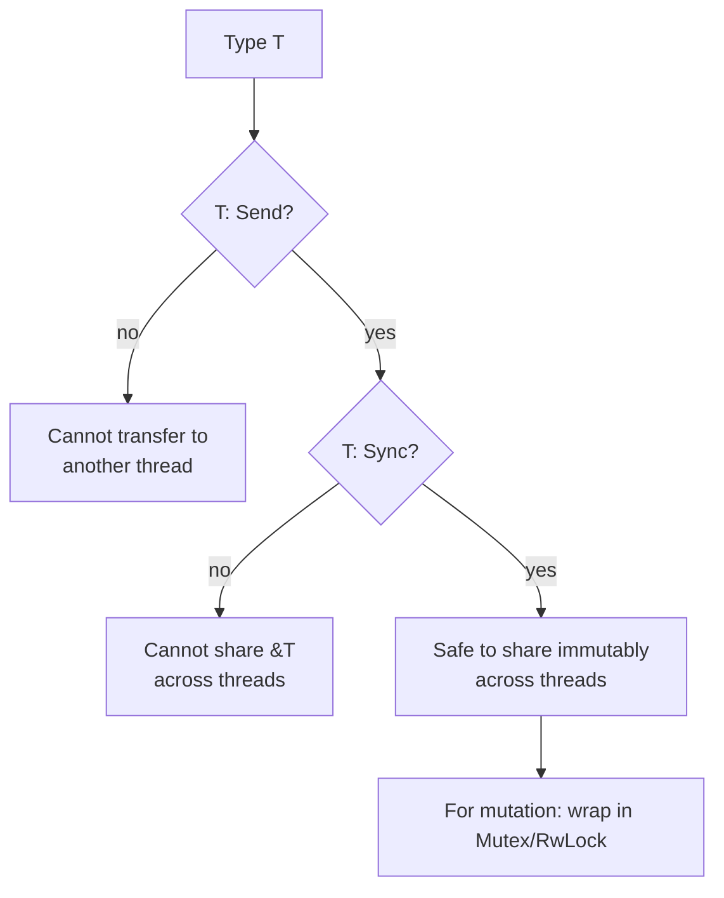

## Question

Explain Rust's ownership and borrowing system. How do the `Send` and `Sync` traits enforce thread safety at compile time, making data races a compile error rather than a runtime bug?

## Answer

**Ownership rules (single-threaded safety):**
1. Every value has exactly one owner.
2. When the owner goes out of scope, the value is dropped (freed).
3. You can have either: one mutable reference (`&mut T`) OR any number of immutable references (`&T`) — never both simultaneously.

**Rule 3 prevents data races:** A data race requires concurrent write + read or write + write. The borrow checker ensures only one writer exists at any point in time — statically, at compile time.

```rust
let mut data = vec![1, 2, 3];
let r1 = &data;        // immutable borrow
let r2 = &data;        // another immutable borrow — OK
let w = &mut data;     // ERROR: cannot borrow mutably while immutably borrowed
```

**`Send` and `Sync` traits:**

- **`Send`:** A type is `Send` if it's safe to transfer ownership to another thread. Most types are `Send` (integers, Vec, String). Not `Send`: `Rc<T>` (non-atomic reference count — use `Arc<T>` instead).

- **`Sync`:** A type is `Sync` if it's safe to share a reference `&T` across threads. `T: Sync` iff `&T: Send`. `Mutex<T>` is `Sync` (provides safe interior mutability). `Cell<T>` is NOT `Sync`.

```rust
use std::sync::{Arc, Mutex};

let counter = Arc::new(Mutex::new(0));
let c = Arc::clone(&counter);

let thread = std::thread::spawn(move || {
    *c.lock().unwrap() += 1;   // Mutex ensures exclusive access
});
thread.join().unwrap();
```

**Compile-time guarantee:** If you try to share a non-`Sync` type across threads, the compiler refuses:
```rust
use std::cell::Cell;
let x = Cell::new(0);
std::thread::spawn(move || { x.set(1); });  // ERROR: Cell<i32> is not Send
```



**Result:** In Rust, data races are impossible in safe code. The borrow checker's compile-time analysis eliminates an entire class of bugs that require race detectors and stress testing in other languages.

## Follow-ups

- What is `Arc<Mutex<T>>` and why is this the idiomatic way to share mutable state in Rust?
- How do `Rc<T>` and `Arc<T>` differ? Why isn't `Rc<T>` `Send`?
- What does `unsafe` Rust allow, and how can unsafe code create data races?
