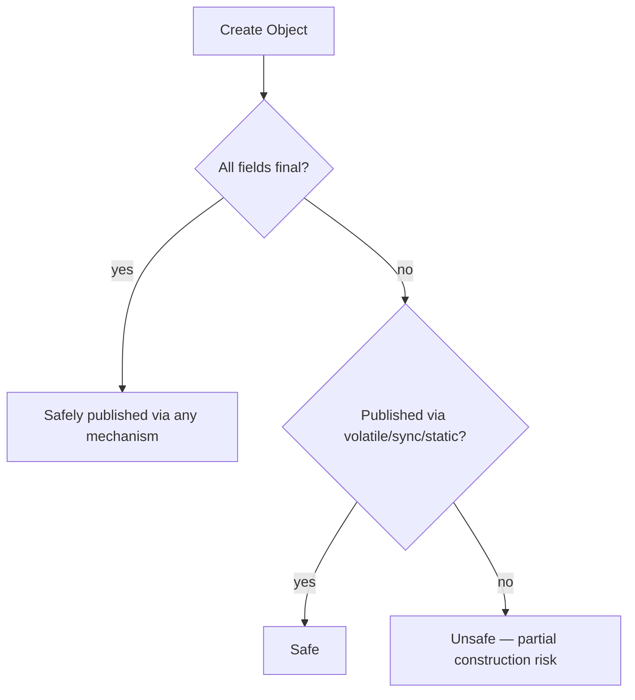

## Question

Explain "safe publication" of objects in Java: why naively passing a reference to another thread can result in seeing a partially constructed object, and the four safe publication mechanisms.

## Answer

**The problem — partial construction:**

```java
class Config {
    public int timeout;
    public String host;
    Config() { timeout = 30; host = "db.example.com"; }
}

// Thread A:
sharedConfig = new Config();   // NOT safe publication

// Thread B:
if (sharedConfig != null) {
    connect(sharedConfig.host);  // may see null host!
    // The reference is non-null but the object's fields aren't visible yet
}
```

Without proper synchronization, the JVM may publish the `sharedConfig` reference before the constructor's writes are flushed to other cores (due to store reordering).

**Four safe publication mechanisms:**

**1. `static` initializer:**
```java
static final Config config = new Config();
// JVM guarantees class initialization is thread-safe (class loader lock)
```

**2. `volatile` field:**
```java
volatile Config config;
// Write to volatile flushes all prior writes (including constructor)
config = new Config();  // safe — happens-before for volatile write
```

**3. `final` fields:**
```java
class Config {
    final int timeout;   // ← final
    final String host;
    Config() { timeout = 30; host = "db.example.com"; }
}
// JMM guarantees: any thread seeing the reference sees final fields fully initialized
// Non-final fields still need synchronization!
```

**4. Synchronization (lock, AtomicReference):**
```java
synchronized(lock) { config = new Config(); }
// OR
AtomicReference<Config> ref = new AtomicReference<>();
ref.set(new Config());
```

**Immutable objects are always safely publishable** via any of the above — if all fields are `final` and the referenced objects are also immutable.

**Effectively immutable objects:** Not technically immutable but never modified after construction. Safe to publish via volatile or synchronization. Unsafe via unsafe publication (direct reference without synchronization).



## Follow-ups

- Why are `final` fields special in the JMM's safe publication guarantee?
- Can you safely publish an immutable object via a `HashMap`? (No — HashMap itself isn't thread-safe. Use `ConcurrentHashMap` or `Collections.unmodifiableMap` with volatile.)
- How does the `@GuardedBy` annotation from JCIP (Java Concurrency in Practice) help document thread-safety?
