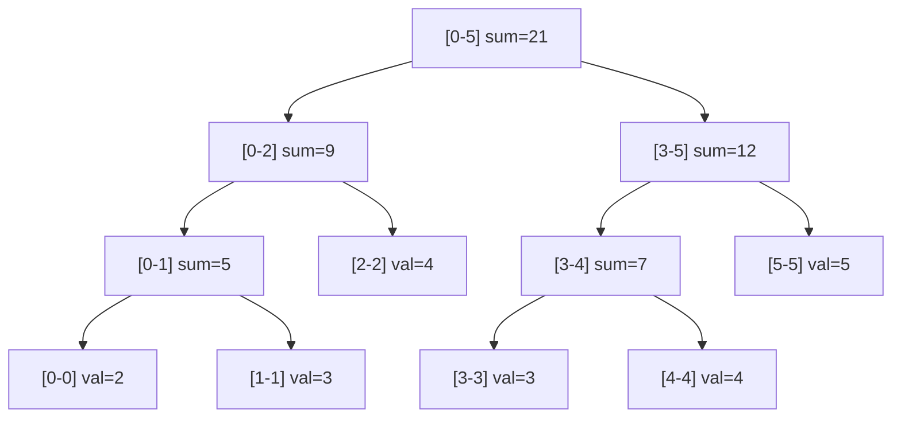

## Question

Explain the segment tree data structure. Show how to build one for range sum queries and point updates in O(log n). Then explain lazy propagation for range updates.

## Answer

**Segment tree:** A binary tree where each node stores the aggregate (sum, min, max) of a contiguous subarray. Leaves hold individual elements.



**Build:** Recursively split [lo, hi] into [lo, mid] and [mid+1, hi]. O(n) time, O(4n) space (array representation).

**Point update:** Walk from root, update the affected path to the leaf. O(log n).

**Range query:** Decompose [ql, qr] into O(log n) non-overlapping segments, aggregate results. O(log n).

```python
def query(node, lo, hi, ql, qr):
    if ql > hi or qr < lo: return 0       # out of range
    if ql <= lo and hi <= qr: return tree[node]  # fully covered
    mid = (lo + hi) // 2
    return (query(2*node, lo, mid, ql, qr) +
            query(2*node+1, mid+1, hi, ql, qr))
```

**Lazy propagation (range updates):**
When updating a range [ql, qr] by +delta, instead of propagating to all leaves immediately, store the pending update at the highest covering nodes. Push down lazily when those nodes are later visited.

Without lazy: range update = O(n). With lazy: O(log n).

**Segment tree vs prefix sum:**

| | Prefix Sum | Segment Tree |
|---|---|---|
| Build | O(n) | O(n) |
| Range query | O(1) | O(log n) |
| Point update | O(n) rebuild | O(log n) |
| Range update | O(n) | O(log n) with lazy |

Use prefix sums for static arrays with frequent queries. Use segment tree for dynamic updates.

## Follow-ups

- How does a segment tree with lazy propagation handle "set all elements in range to X"?
- What is a merge sort tree (segment tree of sorted vectors) and what problems does it solve?
- How does a persistent segment tree differ from a standard one?
