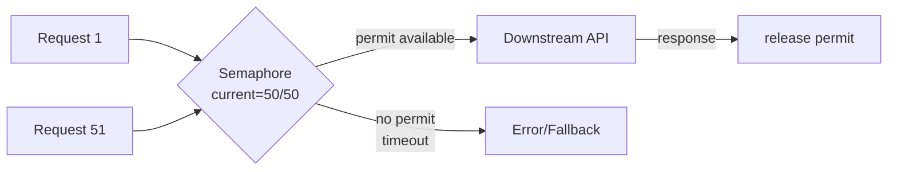

## Question

Explain how to use a semaphore as a bulkhead to limit concurrent access to a scarce resource (DB connections, external API calls). Show Java and Go implementations and compare with using a bounded queue.

## Answer

**Problem:** Your service calls a downstream API that can only handle 50 concurrent requests. Without limiting, a burst of 1000 concurrent requests overwhelms the downstream service.

**Semaphore as bulkhead:**

```java
// Java — Semaphore
Semaphore semaphore = new Semaphore(50);  // max 50 concurrent

public Response callDownstream(Request req) throws Exception {
    if (!semaphore.tryAcquire(500, TimeUnit.MILLISECONDS)) {
        throw new ServiceUnavailableException("Too many concurrent calls");
    }
    try {
        return downstream.call(req);
    } finally {
        semaphore.release();
    }
}
```

```go
// Go — buffered channel as semaphore
sem := make(chan struct{}, 50)

func callDownstream(ctx context.Context, req Request) (Response, error) {
    select {
    case sem <- struct{}{}:   // acquire
    case <-ctx.Done():
        return Response{}, ctx.Err()
    case <-time.After(500 * time.Millisecond):
        return Response{}, ErrTooManyConcurrent
    }
    defer func() { <-sem }()  // release
    return downstream.call(ctx, req)
}
```



**Semaphore vs bounded queue:**
- **Semaphore:** Callers block (or timeout) in-thread waiting for a permit. Good for synchronous flows.
- **Bounded queue:** Callers enqueue work and return; workers process from queue. Good for async flows, decouples caller from execution.
- **Resilience4j Bulkhead:** Uses semaphores or thread pools with configurable max concurrent calls and wait time. Production-ready with metrics and circuit breaker integration.

**Fair semaphore:** `new Semaphore(N, true)` — FIFO order, prevents starvation but slightly slower.

**Fairness matters:** Under bursty load, unfair semaphore may starve some callers while others get permits repeatedly. Use fair semaphore for request-handling fairness.

## Follow-ups

- How does Resilience4j's Bulkhead differ from a Semaphore bulkhead and a ThreadPool bulkhead?
- What happens if a permit holder crashes without calling release? (Use try-finally — always release in `finally`.)
- How would you combine a semaphore with a circuit breaker for downstream calls?
