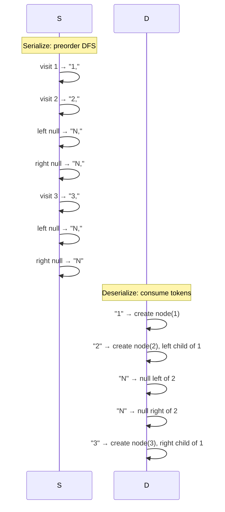

## Question

Design an algorithm to serialize a binary tree to a string and deserialize it back to the original structure. The serialization must handle null nodes and reconstruct the exact tree (not just a BST, any binary tree).

## Answer

**Why preorder with null markers works:**

The key insight: to uniquely reconstruct a general binary tree, you need to encode the structure (where nulls are). Preorder traversal with explicit null markers is self-describing.

**Serialize (DFS preorder):**
```python
def serialize(root):
    if not root:
        return 'N'
    return f"{root.val},{serialize(root.left)},{serialize(root.right)}"
```
Example: `1,2,N,N,3,N,N` for tree:
```
    1
   / \
  2   3
```

**Deserialize:**
Use a queue/iterator of the comma-split tokens:
```python
def deserialize(data):
    vals = iter(data.split(','))
    def build():
        v = next(vals)
        if v == 'N': return None
        node = TreeNode(int(v))
        node.left = build()
        node.right = build()
        return node
    return build()
```

**BFS (level-order) approach:**
```
"1,2,3,N,N,N,N"
```
Encode level-by-level; null means no children. Deserialize using a queue of parents.



**Why inorder alone doesn't work:** Inorder traversal of `[1,2]` and `[2,1]` can produce the same sequence depending on tree shape. You need preorder+inorder OR null markers.

**BST special case:** For BSTs, just preorder values (no null markers) suffice because the BST property reconstructs structure.

## Follow-ups

- How would you serialize a general N-ary tree?
- Serialize in a compact binary format rather than a string — what encoding would you use?
- The JSON representation of a tree — how is it structurally different from preorder encoding?
