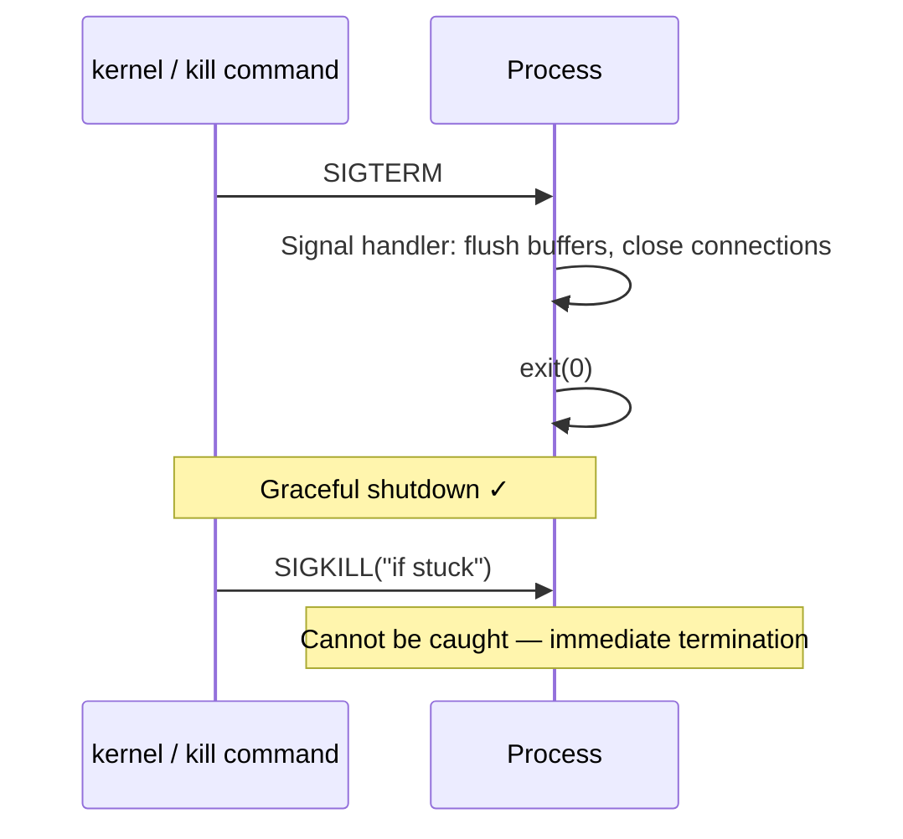

## Question

Explain Linux signals: what they are, the key signals every developer must know (SIGTERM, SIGKILL, SIGINT, SIGHUP, SIGUSR), how signal handlers work, and why graceful shutdown is critical for production services.

## Answer

**Signals:** Asynchronous notifications delivered to a process by the kernel or another process. The process can choose to: ignore, handle (custom handler), or use the default action.

**Essential signals:**

| Signal | Default | Meaning |
|---|---|---|
| SIGTERM (15) | Terminate | Polite shutdown request. **Can be caught/ignored.** Correct way to stop a service. |
| SIGKILL (9) | Terminate | Force kill. **Cannot be caught or ignored.** Use as last resort. |
| SIGINT (2) | Terminate | Ctrl+C. Can be caught. |
| SIGHUP (1) | Terminate | Terminal hangup; conventionally: reload config. |
| SIGCHLD (17) | Ignore | Child process terminated. Parent must handle to reap zombies. |
| SIGUSR1/2 (10/12) | Terminate | User-defined. Services use for: log rotation, diagnostics, profiling. |
| SIGPIPE (13) | Terminate | Write to a closed pipe/socket. Often **ignored** in servers. |
| SIGABRT (6) | Core dump | Abort — usually from assertion failure or `abort()`. |
| SIGSEGV (11) | Core dump | Segmentation fault — invalid memory access. |



**Signal handler rules (async-signal-safety):**

Signal handlers run asynchronously — they can interrupt any code, even malloc or printf. Only **async-signal-safe** functions may be called in handlers:
- `write()` (not `printf`)
- `_exit()` (not `exit()`)
- `sem_post()`

**Correct graceful shutdown pattern:**
```c
volatile sig_atomic_t shutting_down = 0;

void handle_sigterm(int sig) {
    shutting_down = 1;  // async-signal-safe
}

int main() {
    signal(SIGTERM, handle_sigterm);
    while (!shutting_down) {
        process_request();
    }
    cleanup_and_exit();
}
```

**In containers/Kubernetes:** Kubernetes sends SIGTERM on pod deletion; waits `terminationGracePeriodSeconds` (default 30s); then sends SIGKILL. Services **must** handle SIGTERM for graceful shutdown. PID 1 issues: in Docker, PID 1 by default doesn't propagate signals to child processes — use `tini` as init or `exec` to replace the shell.

## Follow-ups

- What is the difference between `kill -9 <pid>` and `kill -15 <pid>`?
- How do you send SIGUSR1 to a running Go process to trigger a goroutine dump?
- Why is PID 1 special for signal handling in Docker containers?
