## Question

The sliding window technique reduces many O(n²) substring/subarray problems to O(n). Explain the fixed-size and variable-size variants with a concrete example for each.

## Answer

**Fixed-size window:** Window size k is constant. Slide one element at a time — add right, remove left.

*Example: Maximum sum subarray of size k.*
```
window_sum = sum(arr[0:k])
max_sum = window_sum
for i in k..n:
    window_sum += arr[i] - arr[i - k]
    max_sum = max(max_sum, window_sum)
```
O(n) vs O(n²) brute force.

**Variable-size window:** Expand right freely; shrink from left when a condition is violated.

*Example: Longest substring without repeating characters.*
```
left = 0, seen = {}
for right in 0..n:
    while arr[right] in seen:
        seen.remove(arr[left])
        left++
    seen.add(arr[right])
    max_len = max(max_len, right - left + 1)
```



```mermaid
sequenceDiagram
    Note over left,right: "abcba"
    right->>right: add 'a' → window=[a]
    right->>right: add 'b' → window=[ab]
    right->>right: add 'c' → window=[abc]
    right->>right: 'b' repeat → shrink
    left->>left: remove 'a', advance left
    Note over left,right: window=[bc], then add 'b' again → shrink...
```

**When to use sliding window:**
- Problem asks for optimal (max/min/count) contiguous subarray/substring.
- There's a monotone relationship: adding elements worsens/improves the condition → expanding right always has a predictable effect, shrinking left can fix violations.

**Common pitfalls:**
- Forgetting to shrink the window when the condition is violated.
- Off-by-one in window size: `right - left + 1` vs `right - left`.
- Not handling the final window after the loop ends.

**Classic problems:** Max consecutive 1s with at most k zeros, minimum window substring, longest subarray with sum ≤ k.

## Follow-ups

- "Minimum window substring" — how do you track whether a window satisfies the character-count requirement efficiently?
- How does sliding window relate to two pointers? (Same technique, different framing.)
- Can sliding window handle non-contiguous subsequences? (No — use DP for subsequences.)
