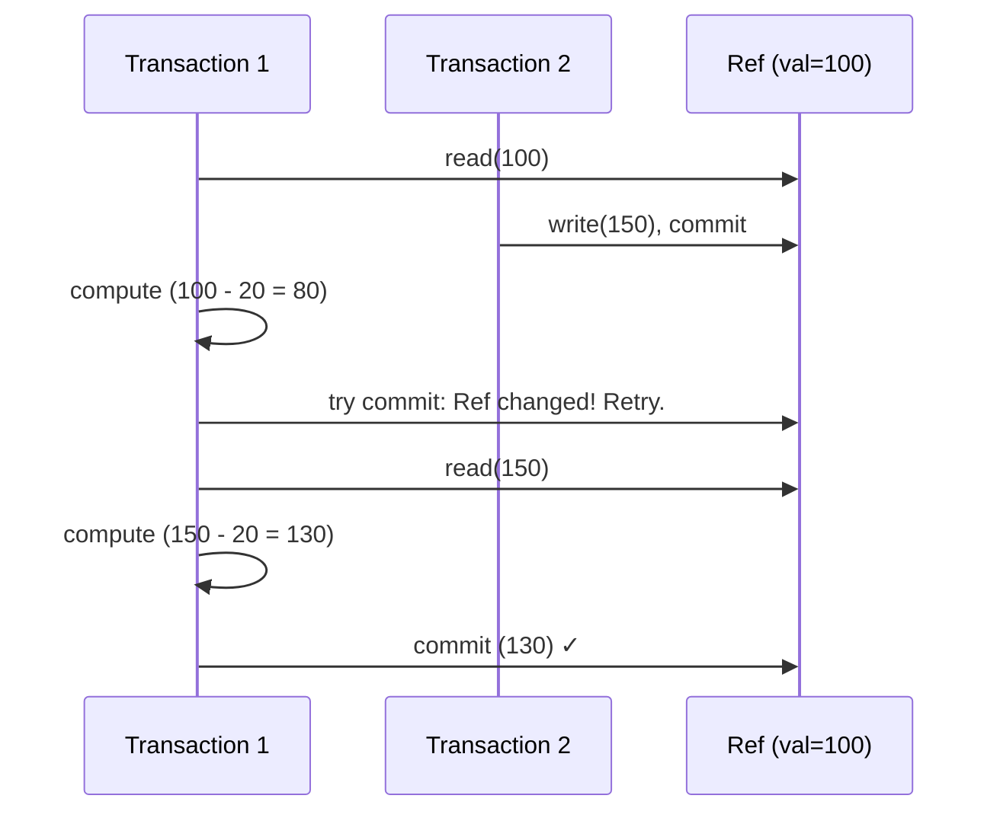

## Question

Explain Software Transactional Memory (STM): how it provides atomic, consistent, isolated updates to shared state without explicit locks, and how Clojure's STM is implemented using MVCC.

## Answer

**STM concept:** Treat memory operations like database transactions. Group reads and writes into a transaction. Commit atomically; retry if conflicts detected.

```clojure
; Clojure STM example
(def account-a (ref 1000))
(def account-b (ref 500))

(defn transfer [from to amount]
  (dosync                       ; transaction boundary
    (alter from - amount)       ; debit
    (alter to + amount)))       ; credit

(transfer account-a account-b 200)
; Atomic! Both refs update or neither does.
```

**How Clojure STM works (MVCC-based):**

1. **`ref` wraps a value.** Inside `dosync`, reads and writes are tracked.
2. **Optimistic execution:** Transaction proceeds without locking, using the current committed value of each `ref`.
3. **Validation:** Before commit, check that every `ref` read hasn't been modified by another committed transaction since we read it. If clean → commit (update committed values). If conflict → **retry** from the beginning.
4. **MVCC versioning:** Each `ref` maintains a history of committed values. Readers see a consistent snapshot without blocking writers.



**STM vs locks:**

| | STM | Locks |
|---|---|---|
| Composability | ✓ (transactions compose) | ✗ (nested locks → deadlock) |
| Deadlock | Impossible | Possible |
| Starvation | Possible (livelock on conflict) | Possible |
| Performance | Good for low-medium contention | Good for all contention levels |
| Mental model | Simpler | Complex |

**Hardware TM (Intel RTM, TSX):** CPU hardware supports speculative execution of transactions — retries automatically on conflict. Very fast but limited by cache size and unsupported operations (I/O, syscalls).

**Where STM is practical:** Clojure, Haskell (`STM` monad), Scala (ScalaSTM). Not widely adopted in mainstream Java/Go — explicit locking or channels preferred.

## Follow-ups

- Why can't STM transactions include I/O operations?
- How does Clojure's `atom` differ from a `ref` — when do you use each?
- What is the "ABA problem" in STM, and does MVCC solve it?
