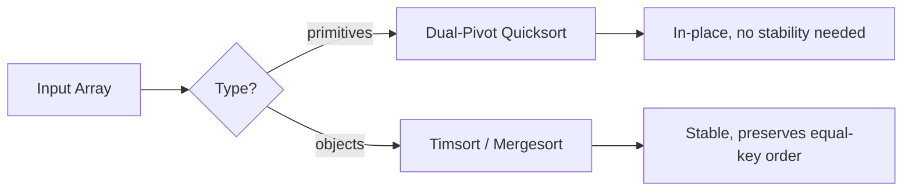

## Question

Walk through the key properties of the four most common comparison sorts. Which languages use which, and why? What makes a sort algorithm "stable" and when does it matter?

## Answer

| Algorithm | Average | Worst | Space | Stable | In-place |
|---|---|---|---|---|---|
| Quicksort | O(n log n) | O(n²) | O(log n) stack | ❌ | ✓ |
| Mergesort | O(n log n) | O(n log n) | O(n) | ✓ | ❌ |
| Heapsort | O(n log n) | O(n log n) | O(1) | ❌ | ✓ |
| Timsort | O(n log n) | O(n log n) | O(n) | ✓ | ❌ |

**Quicksort:** Partition around a pivot; recursively sort each side. Worst case (sorted input + bad pivot) is O(n²) — mitigated by random pivot or median-of-three. Very cache-friendly (in-place, sequential access). Java uses Dual-Pivot Quicksort for primitives.

**Mergesort:** Divide in half, sort each, merge. Stable and predictable O(n log n). Requires O(n) extra space. Java uses mergesort for object arrays (stability needed to preserve `Comparator` contract). Good for linked lists (no random access needed).

**Heapsort:** Build heap O(n), extract n times O(n log n). Worst-case O(n log n) in O(1) space. But poor cache behavior (heap accesses jump around) → in practice slower than quicksort.

**Timsort:** Hybrid of mergesort + insertion sort. Detects naturally ordered runs; merges them. Python and Java's `Arrays.sort` for objects. Exploits real-world "mostly sorted" data. Best case O(n) for already-sorted input.

**Stability matters** when you sort by multiple keys in sequence: sort by name, then by age → stable age-sort preserves the name order within each age group.

**Introsort:** Starts as quicksort, switches to heapsort when depth exceeds 2 log n. Used in C++ STL. Gets quicksort's average-case speed with heapsort's worst-case guarantee.

## Follow-ups

- Why is O(n log n) optimal for comparison sorts? (Decision tree lower bound: n! leaves, tree height ≥ log(n!) ≈ n log n.)
- When can you sort in O(n)? (Counting sort, radix sort — non-comparison sorts exploiting value range.)
- You're sorting 1 billion integers that don't fit in RAM. What approach do you use?
