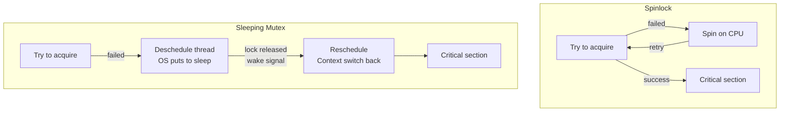

## Question

Compare spinlocks (busy-waiting) with sleeping mutexes (blocking). Explain the tradeoffs in terms of CPU usage, latency, and context, and give concrete rules for choosing one over the other.

## Answer

**Spinlock:** Thread repeatedly checks ("spins") whether the lock is available in a tight loop.
```c
while (atomic_test_and_set(&lock)) { /* spin */ }
// critical section
atomic_clear(&lock);
```

**Sleeping mutex (blocking lock):** Thread that can't acquire the lock is descheduled — removed from the CPU run queue. When the lock is released, the thread is woken up.



**Comparison:**

| | Spinlock | Sleeping Mutex |
|---|---|---|
| CPU when waiting | Burns 100% (busy-wait) | 0% (sleeping) |
| Latency when lock free | Very low (no syscall) | Low (acquire succeeds) |
| Latency on contention | Low if short wait | High (context switch ~µs) |
| Context switch cost | Avoided | ~1-5 µs per switch |
| Appropriate for | Sub-µs hold times | Multi-µs or longer holds |
| Preemption risk | Dangerous if holder preempted | Safe (holder continues sleeping) |

**Rules:**
- Use **spinlock** when: critical section is very short (< context switch cost), lock is held for nanoseconds, running on multi-core (spinning on single-core wastes the only CPU).
- Use **sleeping mutex** when: lock is held for any meaningful duration (disk I/O, complex computation), or on single-core systems.

**Spinlocks in the kernel:** Linux kernel uses spinlocks for interrupt handlers and short-duration kernel data structures (cannot sleep in interrupt context). Everything else uses mutexes or semaphores.

**Adaptive spinlock (hybrid):** Try spinning for a short time; if lock not acquired, sleep. Used in Linux `mutex_lock()` for kernel mutexes, and in JVM's `ObjectMonitor` (Java `synchronized`).

**Danger — spinlock + preemption:** If the lock holder is preempted mid-section, all spinners waste CPU until the holder is rescheduled. Kernel spinlocks disable preemption on the local CPU while held.

## Follow-ups

- Why are spinlocks dangerous on single-CPU systems?
- What is a ticket spinlock and how does it provide FIFO fairness?
- How does Linux's `rwlock_t` differ from `pthread_rwlock_t`?
