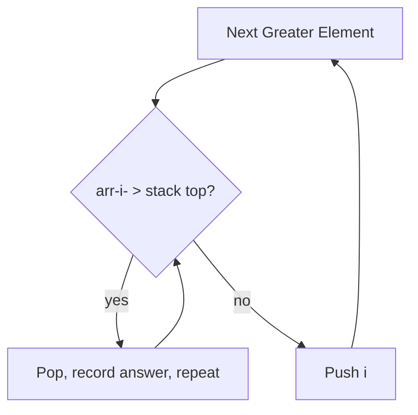

## Question

Stacks appear throughout algorithms beyond simple LIFO storage. Name and explain at least five distinct algorithmic applications of a stack, and explain why the LIFO property is the key insight for each.

## Answer

1. **Balanced parentheses / bracket matching** — push open brackets, pop on close and verify match. LIFO ensures inner brackets close before outer ones.

2. **Expression evaluation and conversion** — shunting-yard algorithm converts infix to postfix; postfix evaluation uses a stack to hold operands. LIFO naturally mirrors operator precedence and associativity.

3. **Function call stack** — every language runtime uses a call stack: push frame on call, pop on return. Recursion is literally a stack.

4. **DFS traversal (explicit stack)** — iterative DFS replaces the implicit recursion stack with an explicit one, enabling safe traversal of deep graphs.

5. **Monotonic stack — next greater element:**
   Maintain a decreasing stack; when a larger element arrives, pop and record the answer.
   ```
   for i in range(n):
       while stack and arr[stack[-1]] < arr[i]:
           result[stack.pop()] = arr[i]
       stack.append(i)
   ```
   Used in: daily temperatures, largest rectangle in histogram, trapping rain water.

6. **Undo/redo** — each action is pushed; undo pops; redo pushes back to a redo stack.

7. **Backtracking** — explicit state stack replaces recursion in maze solving, Sudoku, etc.



## Follow-ups

- Implement a stack that supports `push`, `pop`, and `getMin` all in O(1).
- How would you implement a queue using two stacks? What are the amortized costs?
- Explain how the monotonic stack solves "largest rectangle in histogram" in O(n).
