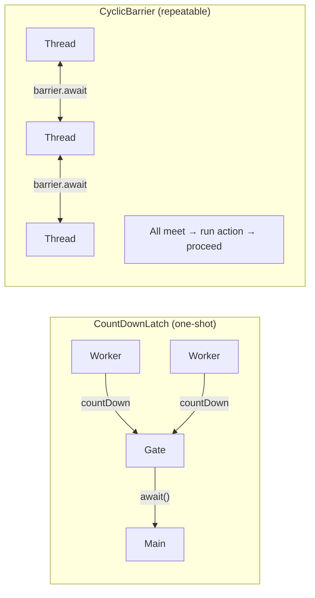

## Question

Compare the three Java synchronizer utilities: `CountDownLatch`, `CyclicBarrier`, and `Phaser`. Explain the problem each solves, whether it's reusable, and give a concrete use case for each.

## Answer

**`CountDownLatch(int count)`:**
- One-time use (not resettable).
- N threads call `countDown()` to signal completion; main thread blocks on `await()` until count reaches 0.
- **Direction:** Many → One. N workers signal one waiter.

```java
CountDownLatch latch = new CountDownLatch(3);
// Thread 1, 2, 3: latch.countDown() when done
latch.await();  // main thread waits for all 3
```

*Use case:* Wait for service initialization before accepting requests. Start all workers then await latch.

**`CyclicBarrier(int parties, Runnable action)`:**
- **Reusable** — resets automatically after all parties arrive.
- All threads block at the barrier until all N arrive, then all proceed together (optionally running a barrier action).
- **Direction:** N → N. Synchronize N peers at a rendezvous point.

```java
CyclicBarrier barrier = new CyclicBarrier(3, () -> mergeResults());
// Each thread: barrier.await() after phase 1
// All three synchronize, mergeResults() runs, then all proceed to phase 2
```

*Use case:* Multi-threaded computation with phases — parallel workers, synchronize between phases, repeat.

**`Phaser`:**
- **Dynamic registration** — parties can register/deregister at runtime.
- Multiple phases — advance through phases explicitly.
- Supports hierarchical phasers for scalability.
- Replaces both Latch and Barrier with more flexibility.

```java
Phaser phaser = new Phaser(3);
// Thread: phaser.arriveAndAwaitAdvance() to sync at phase boundary
// Deregister: phaser.arriveAndDeregister()
```

*Use case:* Graph of tasks with dependencies where the number of participants changes over time.



**Summary:**

| | CountDownLatch | CyclicBarrier | Phaser |
|---|---|---|---|
| Reusable | ✗ | ✓ | ✓ |
| Dynamic parties | ✗ | ✗ | ✓ |
| Barrier action | ✗ | ✓ | ✓ |
| Pattern | N→1 | N↔N | Flexible |

## Follow-ups

- What happens in `CyclicBarrier` if one thread throws an exception at the barrier?
- How would you implement a `CountDownLatch` using a `Semaphore`?
- When would you use `Exchanger` instead of a barrier?
