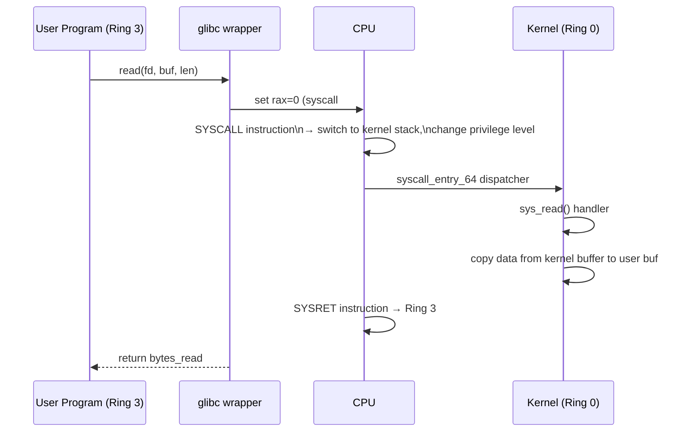

## Question

Trace the execution path of a system call (e.g., `read()`) from the C library through to the kernel handler and back. Explain the mode switch, why syscalls are expensive, and how vDSO avoids the cost for some calls.

## Answer

**Why system calls exist:** User-space code runs in **Ring 3** (unprivileged). Hardware, files, and network require **Ring 0** (kernel). A controlled gate — the syscall — switches privilege level.

**Execution path:**



**x86-64 syscall mechanism:**
1. App sets `rax` = syscall number, `rdi`, `rsi`, `rdx` = args.
2. Executes `SYSCALL` instruction: saves RIP, switches to kernel stack (from `MSR_LSTAR`), sets Ring 0.
3. Kernel's `entry_SYSCALL_64` dispatches to the handler (via `sys_call_table`).
4. `SYSRET` restores RIP, returns to Ring 3.

**Why it's expensive (~100-300 ns):**
- Saving/restoring registers.
- Switching stacks (user→kernel→user).
- Flushing speculative execution state (Spectre mitigations — IBRS, STIBP).
- Possible TLB flush (KPTI — kernel page-table isolation).

**vDSO (virtual Dynamic Shared Object):**
The kernel maps a small shared library into every process's address space. Functions like `gettimeofday()`, `clock_gettime()`, `getcpu()` can read kernel data directly from a shared memory page — **no mode switch needed**. These functions run 10-100x faster than full syscalls.

```bash
# See vDSO mapping:
cat /proc/self/maps | grep vdso
# 7ffd5ffd5000-7ffd5ffd7000 r-xp 00000000 00:00 0  [vdso]
```

**Reducing syscall overhead:**
- **io_uring:** Batch many I/O operations into a ring buffer; kernel processes them without per-operation syscalls.
- **Seccomp BPF:** Filter syscalls — also adds a BPF check overhead per syscall.
- **`strace` overhead:** `strace` uses ptrace to intercept every syscall — adds ~3µs per syscall.

## Follow-ups

- What is KPTI (Kernel Page-Table Isolation) and how did it slow down syscalls post-Meltdown?
- Difference between `SYSCALL`/`SYSRET` (fast path) and older `INT 0x80` (slow path)?
- How does `strace -c ./program` measure total time spent in each syscall?
