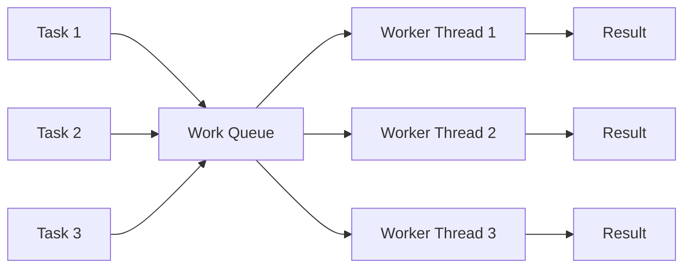

## Question

Explain the purpose of a thread pool, what problems it solves, and how you determine the right pool size for CPU-bound vs I/O-bound workloads. What happens when you size it wrong?

## Answer

**Problems with creating threads on demand:**
1. **Creation cost:** Thread creation takes 1-10 ms (OS call, memory allocation for stack) — too slow for per-request models.
2. **Unbounded resource usage:** 10,000 concurrent requests → 10,000 threads → likely OOM (each thread uses 1-8 MB stack).
3. **Scheduling overhead:** OS can't efficiently schedule thousands of threads.

**Thread pool solution:** Pre-create a fixed pool of threads. Work items go into a queue; idle threads pick them up.



**Sizing rules:**

**CPU-bound tasks** (compute, no waiting): threads should equal CPU cores.
```
pool_size = num_CPU_cores
```
More threads just cause context switching overhead.

**I/O-bound tasks** (disk, network, DB calls): threads can be much higher because most threads are blocked waiting.
```
pool_size = num_CPU_cores × (1 + wait_time / compute_time)
```
If 90% of time is I/O: `pool_size ≈ num_cores × 10`.

**Little's Law approach:** `pool_size = throughput × average_latency`. If you need 1000 req/s with 100 ms average latency: `pool_size = 1000 × 0.1 = 100`.

**What goes wrong with wrong sizing:**

| Too small | Too large |
|---|---|
| Queue fills up, requests rejected | Memory exhaustion (stack per thread) |
| High latency (queuing) | Context switch thrashing |
| Underutilized CPU | Scheduler overhead |

**Java thread pools:**
- `Executors.newFixedThreadPool(n)` — fixed, unbounded queue.
- `Executors.newCachedThreadPool()` — unbounded threads, dangerous under load.
- `ThreadPoolExecutor` — explicit core/max threads, queue, rejection policy.
- Virtual threads (Java 21): essentially unlimited lightweight threads — changes sizing entirely.

**Go:** Goroutines are multiplexed onto `GOMAXPROCS` OS threads (default = num CPUs). No manual sizing for most cases.

## Follow-ups

- What is the difference between core pool size and max pool size in Java's `ThreadPoolExecutor`?
- What rejection policies exist (CallerRuns, Abort, Discard, DiscardOldest) and when to use each?
- How do virtual threads (Project Loom) change the economics of thread pool sizing?
