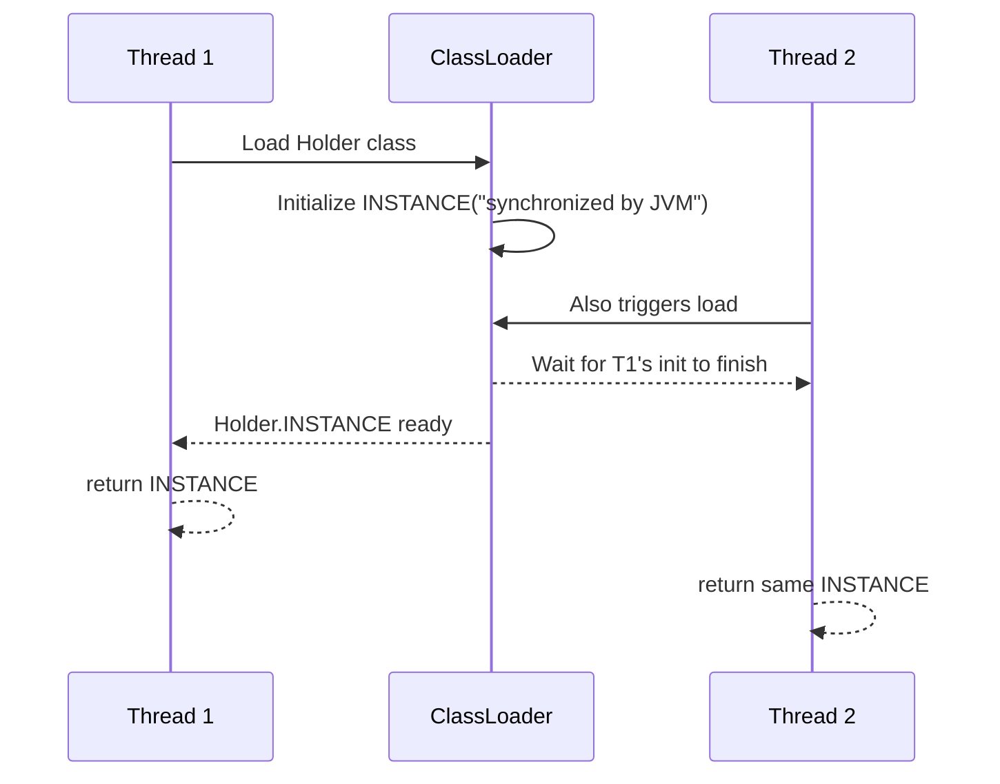

## Question

Walk through the evolution of thread-safe Singleton in Java: the broken naive version, the over-synchronized version, double-checked locking (and why it needs volatile), and the idiom-holder (initialization-on-demand) which needs no locks.

## Answer

**Version 1 — Broken (not thread-safe):**
```java
if (instance == null) {          // Thread A checks
    instance = new Singleton();  // Thread B also checked null → two instances!
}
```

**Version 2 — Over-synchronized (correct but slow):**
```java
public static synchronized Singleton getInstance() {
    if (instance == null) instance = new Singleton();
    return instance;
}
```
Every call acquires the lock — bottleneck for read-heavy usage.

**Version 3 — Double-Checked Locking (with `volatile`):**
```java
private static volatile Singleton instance;

public static Singleton getInstance() {
    if (instance == null) {                     // First check (no lock)
        synchronized (Singleton.class) {
            if (instance == null) {             // Second check (with lock)
                instance = new Singleton();
            }
        }
    }
    return instance;
}
```
`volatile` is required. Without it, the JIT can reorder `instance = new Singleton()` so the reference is published before the object is fully constructed. Another thread sees a non-null but partially initialized object.

**Version 4 — Initialization-On-Demand Holder (best):**
```java
public class Singleton {
    private Singleton() {}
    
    private static class Holder {
        static final Singleton INSTANCE = new Singleton();
    }
    
    public static Singleton getInstance() {
        return Holder.INSTANCE;
    }
}
```
- The `Holder` class is not loaded until `getInstance()` is first called.
- Class loading in Java is guaranteed to be thread-safe (class initializer locks protect it).
- **Zero synchronization overhead after initialization.** The JVM guarantees exactly-once initialization.
- No `volatile`, no `synchronized` in the hot path.



**Modern Java:** Enum singleton is also thread-safe and serialization-safe:
```java
public enum Singleton { INSTANCE; }
```

## Follow-ups

- Why does the enum singleton survive deserialization while the class-based one may not?
- How does Spring's `@Bean` with default scope handle singleton creation in a multi-threaded context?
- Is Singleton a good pattern? When does it become an anti-pattern?
