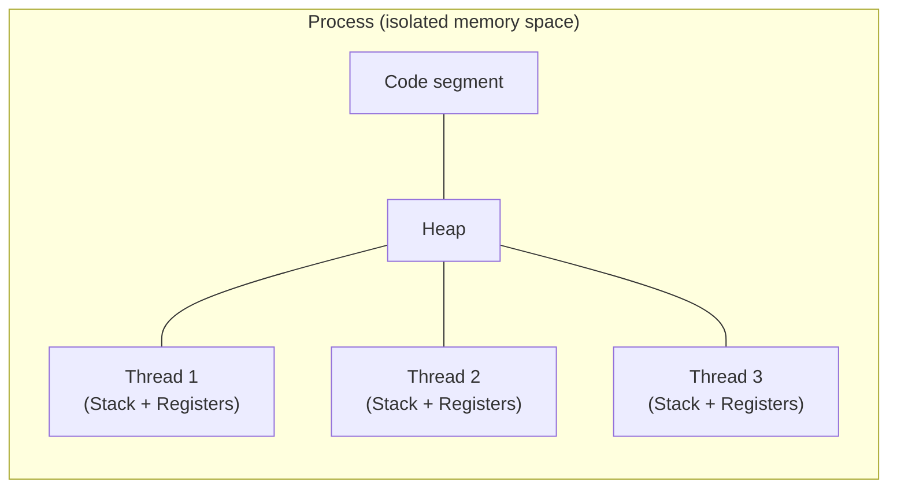

## Question

Explain the differences between threads and processes: what they share, what is isolated, what is the cost of switching between them, and when you'd use one over the other.

## Answer

**What threads share (within a process):**
- Virtual address space (heap, code, globals, file descriptors)
- Open file handles
- Signal handlers
- Working directory

**What each thread owns:**
- Stack (default 1-8 MB on Linux)
- Registers (PC, stack pointer, etc.)
- Thread-local storage
- Signal mask

**Context switch cost:**

| Type | Cost | What changes |
|---|---|---|
| Thread switch (same process) | ~1–10 µs | Registers, stack pointer, TLS |
| Process switch | ~10–100 µs | All of above + page tables, TLB flush, cache pollution |

Process switch is expensive because the CPU must load a new page table, which invalidates the TLB (Translation Lookaside Buffer). Modern CPUs mitigate this with PCID (Process Context Identifiers).

**When to use processes over threads:**
- **Isolation/fault tolerance** — a crashing subprocess doesn't take down the parent (web servers forking workers).
- **Security** — separate address spaces prevent one tenant from reading another's memory (browsers use per-tab processes).
- **Simpler code** — no shared mutable state; communicate via IPC.

**When to use threads:**
- Low-latency data sharing (shared memory is fast, IPC is slow).
- Many lightweight concurrent tasks (thread pools).
- Languages/runtimes with green threads or coroutines (Go goroutines, Java virtual threads) make threads even cheaper.

**On Linux:** Threads are implemented as processes with `clone(CLONE_THREAD)` sharing VM, file tables, etc. — the kernel sees them as "tasks" (`struct task_struct`).

## Follow-ups

- What is a zombie process and how does `wait()` prevent it?
- Explain how `fork()` + `exec()` creates a new process — what is copy-on-write here?
- How do Go goroutines differ from OS threads? (M:N scheduling, 4 KB initial stack.)
