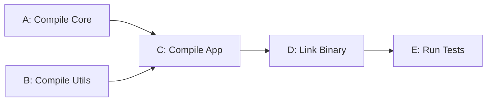
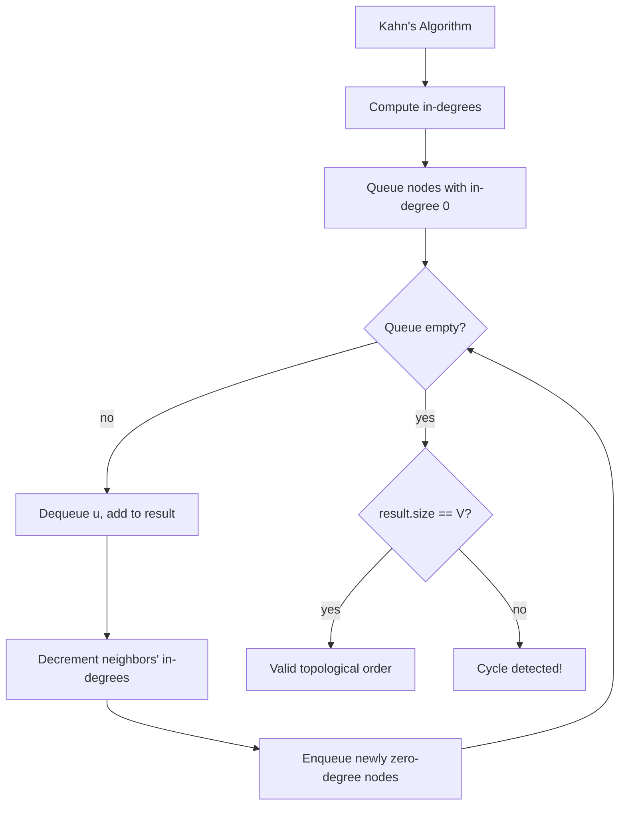

## Question

Explain topological sort: what it is, when it's applicable, and walk through both the DFS-based and Kahn's (BFS/in-degree) algorithms. How do you detect if topological sort is impossible?

## Answer

**Topological sort** produces a linear ordering of vertices in a Directed Acyclic Graph (DAG) such that for every edge u→v, u appears before v. Only possible if the graph is a DAG (no cycles).

**Applications:** Build systems (compile A before B), course prerequisites, task scheduling, dependency resolution.

Valid order: A, B, C, D, E (or B, A, C, D, E).

**Algorithm 1 — Kahn's (BFS-based):**
1. Compute in-degree for every vertex.
2. Enqueue all vertices with in-degree 0.
3. While queue non-empty: dequeue u, add to result, decrement in-degree of u's neighbors; enqueue any that reach 0.
4. If result length < V → cycle exists.

**Algorithm 2 — DFS-based:**
1. DFS from each unvisited node.
2. On finishing a node (all descendants visited), push it to a stack.
3. The stack reversed is the topological order.
4. During DFS, if you reach a node in the current path (gray/in-progress) → cycle.

**Cycle detection:** Kahn's: result.size() < V. DFS: encountering a "gray" node.

**Which to use?** Kahn's is easier to implement iteratively and gives a canonical cycle detection path. DFS-based is compact and naturally fits recursive code.

## Follow-ups

- Can a graph have multiple valid topological orderings? When is it unique? (Unique iff there's a Hamiltonian path through the DAG.)
- How do you find all topological orderings? (Backtracking — exponential.)
- How is topological sort used in dynamic programming on DAGs?
