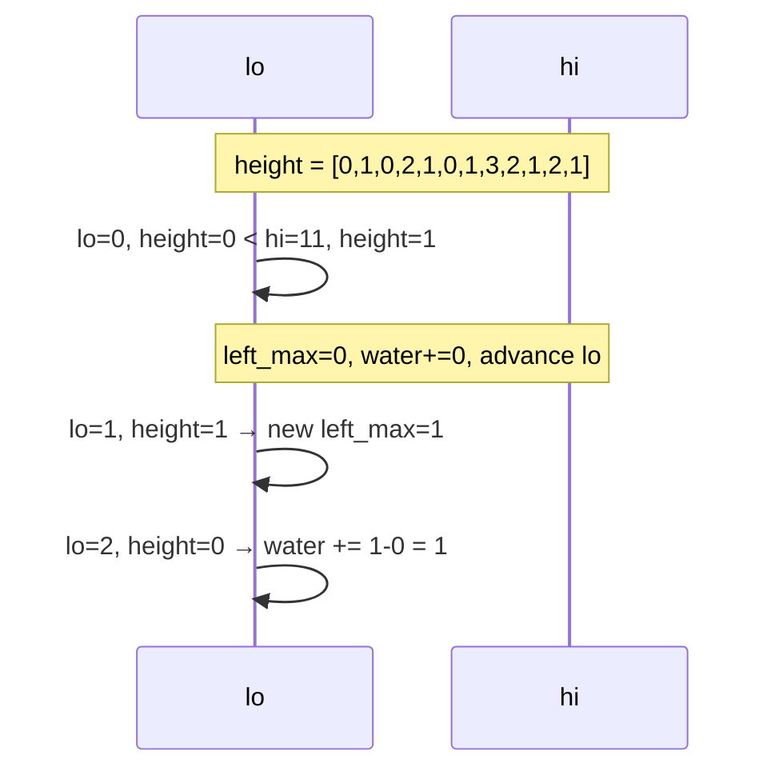

## Question

Given an array of heights, compute how much rainwater can be trapped. Walk through three approaches: brute force, prefix/suffix max arrays, and the two-pointer solution. Explain the key insight for the optimal approach.

## Answer

**Problem:** `height = [0,1,0,2,1,0,1,3,2,1,2,1]` → answer is 6.

Water at position i = `min(max_left[i], max_right[i]) - height[i]` (if positive).

**Approach 1 — Brute force:** For each position, scan left for max and right for max. O(n²) time.

**Approach 2 — Prefix/suffix arrays:** Precompute `left_max[i]` and `right_max[i]`. O(n) time, O(n) space.

**Approach 3 — Two pointers:** O(n) time, O(1) space. The key insight: water at position `i` is constrained by the **shorter** of the two sides. If we know one side is the limiting factor, we can advance from that side.

```python
def trap(height):
    lo, hi = 0, len(height) - 1
    left_max = right_max = 0
    water = 0
    while lo < hi:
        if height[lo] < height[hi]:
            if height[lo] >= left_max:
                left_max = height[lo]
            else:
                water += left_max - height[lo]
            lo += 1
        else:
            if height[hi] >= right_max:
                right_max = height[hi]
            else:
                water += right_max - height[hi]
            hi -= 1
    return water
```

**Why this works:** When `height[lo] < height[hi]`, the right wall is at least as tall as `height[hi]`, so the left side is the bottleneck. We know exactly how much water lo holds: `left_max - height[lo]`. We never need to look right.



**Monotonic stack approach** (alternative O(n)/O(n)): Calculate water layer by layer using a stack of indices. When a taller bar is encountered, pop and compute trapped water between the current bar and the new stack top.

## Follow-ups

- How does the monotonic stack approach compute the water differently?
- What is the "container with most water" problem and how is it different? (Two pointers, no inner bars.)
- Extend to 2D (volume of water in a matrix) — how does it change? (BFS with a min-heap from borders.)
