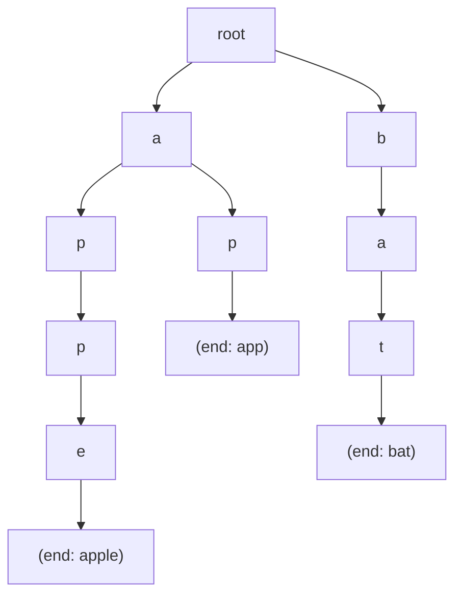

## Question

Explain the Trie (prefix tree) data structure, its time and space complexity, and the specific scenarios where it outperforms a hash map for string-related operations.

## Answer

**Trie structure:** Each node represents one character. The path from root to a marked node spells a word.

**Operations:**
- **Insert:** O(m) where m = word length.
- **Search:** O(m).
- **StartsWith (prefix query):** O(m) — walk to the prefix node; any subtree word matches.
- **Delete:** O(m) — mark node as non-end, prune empty branches.

**Hash map comparison:**

| Capability | Hash Map | Trie |
|---|---|---|
| Exact lookup | O(m) avg | O(m) |
| Prefix search | O(n·m) scan | O(m + results) |
| Sorted iteration | ❌ | ✓ (DFS) |
| Wildcard/regex | ❌ | ✓ (backtracking) |
| Space | O(n·m) compact | O(n·m·alphabet) worst |

**Where Trie wins:**
1. **Autocomplete** — given prefix, enumerate all completions. Trie traverses subtree; hash map must scan all keys.
2. **Spell checking** — find words within edit distance 1 using DFS with error budget.
3. **IP routing (Longest Prefix Match)** — routing tables stored as binary tries; match the longest prefix.
4. **Word search / boggle** — prune dead paths early using trie.
5. **Sorted output** — DFS on trie yields lexicographic order.

**Space optimization:** Compressed trie (Patricia/Radix tree) merges single-child chains into one edge with a string label. Reduces node count significantly.

**Implementation tip:** Use `children: Map<char, TrieNode>` (sparse, handles Unicode) vs `children: TrieNode[26]` (fast for lowercase ASCII only).

## Follow-ups

- How would you implement autocomplete returning the top-k most frequent completions? (Store count at each node; use heap at prefix node.)
- How does a compressed Trie (radix tree) differ from a standard Trie?
- Explain how the Aho-Corasick algorithm extends a Trie for multi-pattern matching.
