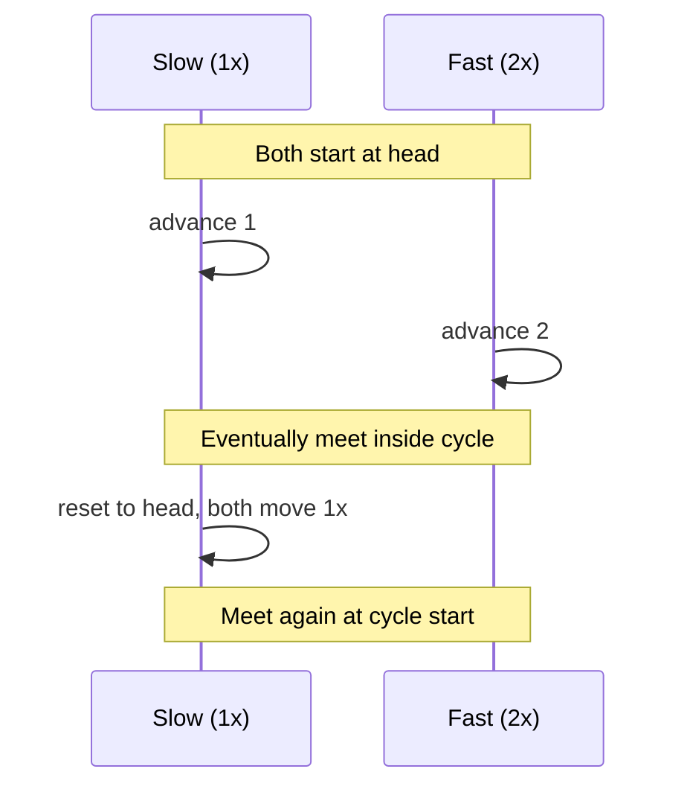

## Question

The two-pointer technique reduces many O(n²) brute-force solutions to O(n). Explain the three main variants (opposite ends, same direction, fast/slow) and give a concrete example for each.

## Answer

**Variant 1: Opposite ends (converging pointers)**

Used on a **sorted** array. Pointers start at both ends and move inward.

*Example: Two-sum in sorted array.*
```
lo, hi = 0, n-1
while lo < hi:
    s = arr[lo] + arr[hi]
    if s == target: return (lo, hi)
    elif s < target: lo++
    else: hi--
```
Correctness relies on sorted order: if sum is too small, increasing `lo` is the only move that can fix it.

**Variant 2: Same direction (fast/slow)**

Both start at 0; fast pointer scouts ahead.

*Example: Remove duplicates from sorted array in-place.*
```
slow = 0
for fast in 1..n:
    if arr[fast] != arr[slow]:
        slow += 1
        arr[slow] = arr[fast]
return slow + 1  # new length
```

**Variant 3: Fast/slow (Floyd's cycle detection)**

Fast moves 2 steps, slow moves 1 step. If there's a cycle, they meet.



*Used for: cycle detection in linked lists, finding duplicate numbers (Floyd on value→index mapping).*

**When two pointers work:** The search space has a monotone structure — moving one pointer in a direction is guaranteed to be better or eliminates the other options.

## Follow-ups

- Container with most water — which pointer do you move and why?
- Three-sum: how do you reduce it from O(n³) to O(n²) with two pointers?
- How does the slow/fast pointer find the *start* of a cycle, not just detect it?
