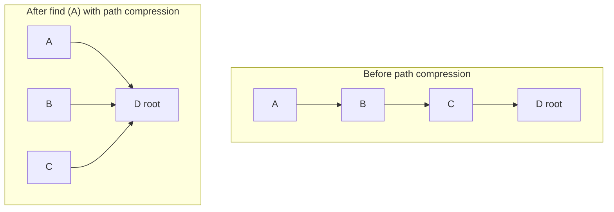

## Question

Describe the Union-Find (Disjoint Set Union) data structure, its `find` and `union` operations, and the two optimizations — union by rank and path compression — that give near-O(1) amortized operations.

## Answer

**Core idea:** Maintain a forest of trees, one tree per connected component. Each node points to its parent; roots are self-pointing (representatives).

**Naive operations:**
- `find(x)`: walk up to root — O(depth).
- `union(x, y)`: find both roots, make one point to the other — O(depth).

Without optimizations, chains degenerate to O(n) per operation.

**Optimization 1 — Union by rank:**
Always attach the shorter tree under the taller one. Rank is an upper bound on height.
```
if rank[rx] < rank[ry]: parent[rx] = ry
elif rank[rx] > rank[ry]: parent[ry] = rx
else: parent[ry] = rx; rank[rx]++
```
This keeps tree height ≤ log n.

**Optimization 2 — Path compression:**
On `find`, make every node on the path point directly to the root.
```
def find(x):
    if parent[x] != x:
        parent[x] = find(parent[x])  # flatten path
    return parent[x]
```

**Combined:** With both optimizations, any sequence of m operations on n elements runs in O(m · α(n)) where α is the inverse Ackermann function — effectively O(1) for all practical n.



**Applications:** Kruskal's MST, detecting cycles in undirected graphs, connected components, network connectivity, image segmentation (percolation).

```python
class UnionFind:
    def __init__(self, n):
        self.parent = list(range(n))
        self.rank = [0] * n
    def find(self, x):
        if self.parent[x] != x:
            self.parent[x] = self.find(self.parent[x])
        return self.parent[x]
    def union(self, x, y):
        rx, ry = self.find(x), self.find(y)
        if rx == ry: return False
        if self.rank[rx] < self.rank[ry]: rx, ry = ry, rx
        self.parent[ry] = rx
        if self.rank[rx] == self.rank[ry]: self.rank[rx] += 1
        return True
```

## Follow-ups

- How do you count the number of connected components with Union-Find?
- Can Union-Find handle disconnecting edges? (No — it's offline. Use Link-Cut Trees for dynamic connectivity.)
- How does Kruskal's MST use Union-Find to detect cycles in O(E log E)?
