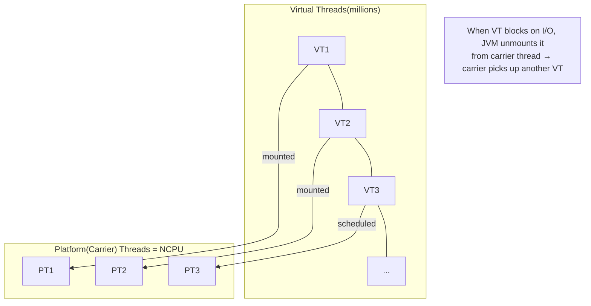

## Question

Explain Java virtual threads introduced in Java 21: how they differ from platform threads, how the JVM schedules them, and what programming model changes (and what doesn't) when you switch to virtual threads.

## Answer

**Problem with platform threads:**

Platform threads map 1:1 to OS threads. OS threads are expensive (~1 MB stack, kernel scheduling). At 10,000 concurrent requests, 10,000 OS threads exhaust memory and scheduler capacity. Traditional solution: async/reactive code (CompletableFuture, Reactor) — but hard to write and debug.

**Virtual threads (Java 21):**

- Lightweight threads managed by the JVM (like goroutines).
- Initially very small stack (hundreds of bytes, grows dynamically).
- **M:N mapping:** Many virtual threads multiplex onto few platform "carrier" threads (typically = CPU cores).
- Created with: `Thread.ofVirtual().start(task)` or `Executors.newVirtualThreadPerTaskExecutor()`.



**Key behavior:** When a virtual thread calls a blocking operation (JDBC, HTTP, file I/O), the JVM **unmounts** it from the carrier thread. The carrier thread is free to run other virtual threads. When the I/O completes, the virtual thread is remounted on any available carrier.

**What changes:**
- Write simple blocking code; the JVM handles concurrency.
- `Executors.newVirtualThreadPerTaskExecutor()` replaces thread pool tuning.
- One-thread-per-request model is back — easier to write, debug, trace.

**What doesn't change:**
- Thread-local variables work but watch for carryover with thread pooling.
- `synchronized` blocks still pin virtual thread to carrier (use `ReentrantLock` instead).
- CPU-bound tasks still need platform threads (virtual threads don't add parallelism, only concurrency).

**Structured concurrency (Java 21+):**
```java
try (var scope = new StructuredTaskScope.ShutdownOnFailure()) {
    var user = scope.fork(() -> fetchUser(id));
    var cart = scope.fork(() -> fetchCart(id));
    scope.join().throwIfFailed();
    return new Response(user.get(), cart.get());
}
```
Guarantees: all forked tasks finish (or are cancelled) before the scope exits.

## Follow-ups

- What does "pinning" mean for virtual threads, and how do you detect it?
- How do virtual threads interact with thread-local variables — what is the ScopedValue alternative?
- Compare Go goroutines vs Java virtual threads: similarities and differences.
