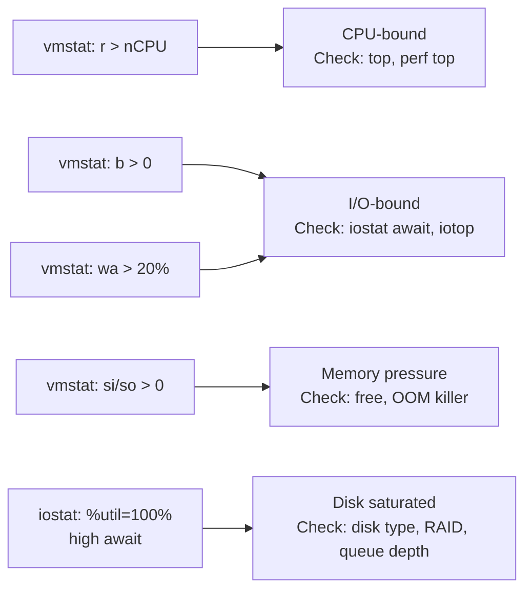

## Question

Walk through using `vmstat`, `sar`, and `iostat` to baseline system performance and identify bottlenecks. Describe what each metric means and how to correlate them into a diagnosis.

## Answer

**`vmstat` — virtual memory statistics (overall view):**
```bash
vmstat 1        # sample every 1 second
# procs --------memory---------- ---swap-- -----io---- --system-- ------cpu-----
# r  b   swpd   free  buff cache   si   so    bi    bo   in   cs us sy id wa st
# 4  0    0   2048M  512M  8192M    0    0   100  5000  12k  25k 45  5 48  2  0

# Key columns:
# r    → runnable processes (waiting for CPU; if > nCPU → CPU-bound)
# b    → blocked in uninterruptible sleep (D state; high → I/O-bound)
# si/so → swap in/out (MB/s; nonzero → memory pressure)
# bi/bo → block device I/O (blocks/s read/write)
# in   → interrupts/s (high with fast NIC)
# cs   → context switches/s
# us/sy/id/wa → CPU% user/system/idle/iowait
```

**`iostat` — disk I/O statistics:**
```bash
iostat -x 1     # extended stats
# Device  r/s  w/s  rkB/s  wkB/s  rrqm/s  wrqm/s  %rrqm %wrqm r_await w_await aqu-sz rareq-sz wareq-sz svctm %util
# sda     50   200  5000   20000     0       5        0      3   1.5     2.1     0.5     100     100    4.1   97.5

# Key metrics:
# r_await/w_await → average latency (ms) — SSD: <1ms; HDD: <10ms; if higher → saturated
# %util → device utilization (100% → saturated)
# aqu-sz → average queue depth (>1 → queueing)
```

**`sar` — system activity reporter (historical view):**
```bash
sar -u 1 10     # CPU utilization, 10 samples
sar -r 1 10     # memory
sar -b 1 10     # block I/O
sar -n DEV 1 10 # network per interface
sar -q 1 10     # run queue (load average)

# Read historical data (collected by sysstat package)
sar -u -f /var/log/sa/sa20   # CPU for day 20
```

**Correlation-based diagnosis:**



**Practical workflow:**
```bash
# 1. Get overview
vmstat 1 5

# 2. If IO bottleneck suspected
iostat -x 1 | grep -v '^$'

# 3. If specific disk
iostat -x /dev/sda 1

# 4. If which process is causing IO
iotop -o

# 5. Historical trending
sar -b 1 > /tmp/io_trend.txt
```

## Follow-ups

- What does a sustained `cs` (context switch) rate of 100k/s indicate?
- How do you differentiate between read-heavy and write-heavy I/O bottlenecks?
- What is `sar`'s collection daemon (`sadc`) and how do you configure its sampling interval?
