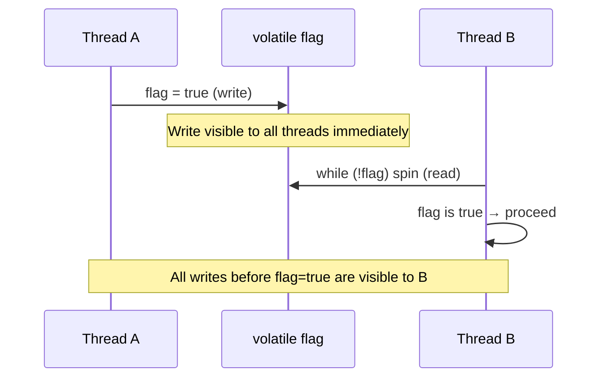

## Question

Explain what Java's `volatile` keyword guarantees, the specific scenarios where it is sufficient, and the common mistakes where developers use `volatile` thinking it's enough but it isn't.

## Answer

**What `volatile` guarantees:**

1. **Visibility:** A write to a `volatile` variable is immediately visible to all other threads. Without `volatile`, threads may read a stale cached value from their local CPU cache.

2. **Happens-before:** A write to a `volatile` variable happens-before every subsequent read of that variable (per the Java Memory Model). This prevents the compiler and CPU from reordering instructions across the volatile access.

3. **No atomicity for compound operations.** This is the critical limitation.



**Where `volatile` is sufficient:**

- **Stop flag:** `volatile boolean stop = false;` — one writer, multiple readers, single assignment.
- **Singleton publication** (safe publication of immutable objects with DCL + volatile).
- **Status indicator:** a single flag that one thread writes and others read.

**Where `volatile` is NOT enough:**

```java
volatile int counter = 0;
// Thread A and B both do:
counter++;  // READ + INCREMENT + WRITE — not atomic!
```

`counter++` is three operations. Two threads can both read `0`, both compute `1`, both write `1`. Counter ends at 1 instead of 2. Use `AtomicInteger.incrementAndGet()` instead.

**Double-checked locking without volatile (broken):**
```java
// BROKEN — instance may be seen partially constructed
if (instance == null) {
    synchronized(Singleton.class) {
        if (instance == null) {
            instance = new Singleton(); // not atomic!
        }
    }
}
```
Object construction involves: allocate memory → set fields → assign reference. Without `volatile`, the compiler can reorder to: allocate → assign reference → set fields. Another thread may see a non-null but incompletely initialized object.

**Fix:** Declare `instance` as `volatile`.

## Follow-ups

- How does `volatile` interact with the happens-before relation in the JMM?
- What is the difference between `volatile` in Java vs C? (C `volatile` only prevents caching in register — no memory ordering guarantees.)
- When would you use `AtomicReference` instead of `volatile`?
