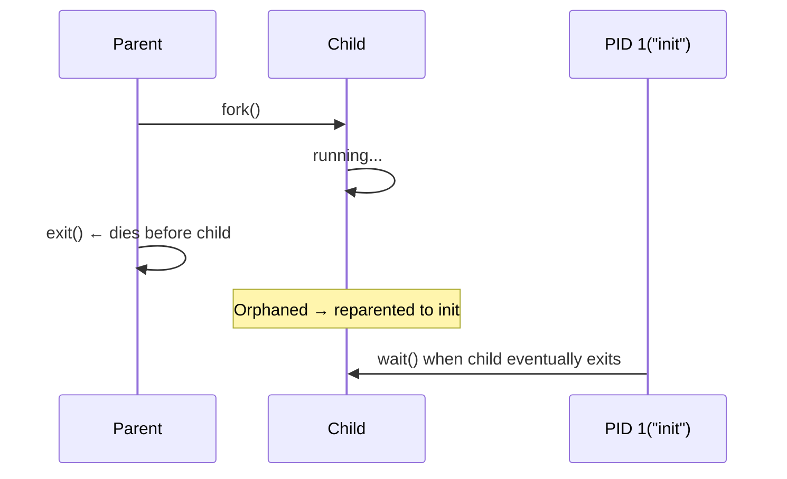

## Question

Explain zombie and orphan processes in Linux: what creates each, why zombies consume resources, how to reap them, and the correct pattern for managing child processes in production daemons.

## Answer

**Zombie process:**
A process that has called `exit()` but whose parent has not yet called `wait()`/`waitpid()` to retrieve its exit status. The process is "dead" but its entry in the process table persists (consuming one PID).

**What zombie retains:** PID, exit code, CPU accounting. No file descriptors, no memory pages — just the process table entry.

**What causes zombies:** Parent process creating children but never calling `wait()`:
```c
pid_t child = fork();
if (child == 0) { exit(0); }     // child exits
// Parent never calls wait() → child becomes zombie
sleep(60);
```

**Zombie accumulation risk:** Each zombie uses one entry in the process table (max ~4 million PIDs on Linux). Thousands of zombies can exhaust the PID namespace.

**Orphan process:**
A process whose parent has exited before it. The kernel automatically reparents orphans to PID 1 (`init`/`systemd`), which calls `wait()` periodically — preventing zombie buildup.



**Preventing zombies — three approaches:**

**1. Call `waitpid()` explicitly:**
```c
waitpid(child_pid, &status, 0);   // blocking
waitpid(-1, &status, WNOHANG);    // non-blocking (check all children)
```

**2. Handle `SIGCHLD`:**
```c
signal(SIGCHLD, SIG_IGN);  // tell kernel to auto-reap children
// OR:
void sigchld_handler(int sig) {
    while (waitpid(-1, NULL, WNOHANG) > 0);  // reap all finished children
}
signal(SIGCHLD, sigchld_handler);
```

**3. Double-fork trick:** Fork, fork again, first child exits immediately — grandchild is orphaned and reparented to init. Parent only needs to `wait()` for the short-lived first child.

**Diagnosis:**
```bash
ps aux | grep Z     # find zombie processes
# Find parent of zombie:
cat /proc/<zombie_pid>/status | grep PPid
```

## Follow-ups

- What is the "double fork" technique and why is it used by daemon-creating code?
- How does `systemd` handle zombie prevention for services it manages?
- What happens if PID 1 itself dies? (Kernel panic — init cannot be killed.)
