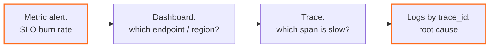

## Question

Explain the three observability signals, what each is good and bad at, and
how they work together when you're debugging a real incident. Where does
cardinality bite you?

## Answer

Think of them by the question each answers:

- **Metrics** — *"Is something wrong, and how much?"* Pre-aggregated numbers
  over time (counters, gauges, histograms). Cheap to store, fast to query,
  ideal for alerting and SLOs. Weakness: aggregation destroys the individual
  event — a metric can say p99 is bad, never *which request* or *why*.
- **Logs** — *"What exactly happened here?"* Arbitrary detail per event,
  greppable, great for one-off investigation. Weakness: expensive at volume,
  and without a correlating ID a log line is an orphan.
- **Traces** — *"Where did this request spend its time?"* One request's tree
  of spans across services, with timing. The only signal that natively
  answers cross-service questions. Weakness: usually sampled, so rare events
  may be missing exactly when you want them (tail-based sampling mitigates —
  decide *after* seeing the outcome, keep the slow/errored ones).

**How they compose in an incident:** the metric alert fires (symptom, via
SLO burn rate) → dashboard narrows *which* service/endpoint/region → an
exemplar or trace search finds a representative slow request and names the
guilty span → logs for that span (via shared `trace_id`) give the
line-level cause. The `trace_id` woven through all three is what makes the
system more than three silos.

**Cardinality:** every unique label combination is its own time series.
`user_id` or `url` as a metric label turns thousands of series into millions
— memory and cost explode. Rule: bounded sets (endpoint template, region,
status class) go in metric labels; unbounded ones (user, request id) belong
in logs, traces, or wide events.

## Follow-ups

- Alert on symptoms vs causes — why, and what's a burn-rate alert?
- Head-based vs tail-based sampling: costs of each?
- A partner reports failures for *their* account only; your dashboards are green. Which signal finds it, and what was wrong with the dashboards?
- Put these signals to work on a real symptom: [[p99-latency]].
