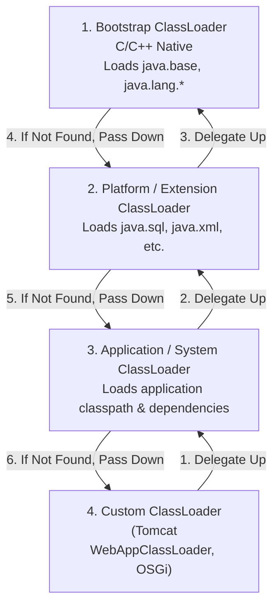

## Question

Explain JVM ClassLoaders: the three default loaders (Bootstrap, Platform/Extension, Application), the Parent Delegation Model, how `ClassNotFoundException` vs `NoClassDefFoundError` differ, and how custom ClassLoaders break delegation (e.g., OSGi, Tomcat).

## Answer

**What is a ClassLoader?**
A ClassLoader is a Java object responsible for dynamically loading `.class` bytecode files into JVM memory at runtime when a class is first referenced.

**The ClassLoader Hierarchy:**



1. **Bootstrap ClassLoader:** Built into the JVM native C++ runtime. Loads core Java runtime classes (`java.lang.*`, `java.util.*` from `java.base`). `String.class.getClassLoader()` returns `null`.
2. **Platform ClassLoader (formerly Extension):** Loads platform modules (`java.sql`, `java.xml`).
3. **Application (System) ClassLoader:** Loads classes from application classpath (`-classpath` or `-jar`). `MyClass.class.getClassLoader()`.
4. **Custom ClassLoaders:** Developed for frameworks (Tomcat, Spring DevTools, OSGi plugin systems).

**Parent Delegation Model:**
When a ClassLoader receives a request to load a class:
1. It checks if the class is already loaded in its local cache.
2. If not loaded, it delegates the search to its **parent** ClassLoader.
3. Only if all parent ClassLoaders fail to find the class does the child ClassLoader attempt to load it via `findClass()`.

**Why Parent Delegation Matters:**
- **Security:** Prevents custom untrusted code from replacing core Java classes (e.g., loading a malicious `java.lang.String`).
- **Uniqueness:** Guarantees a class loaded by a parent is shared across all child loaders without duplication.

**`ClassNotFoundException` vs `NoClassDefFoundError`:**

| Diagnostic | Cause | Example Scenario |
|---|---|---|
| **`ClassNotFoundException`** | Checked exception raised when code explicitly calls `Class.forName()` or `ClassLoader.loadClass()`, but `.class` file isn't on classpath. | Missing JDBC driver class name string. |
| **`NoClassDefFoundError`** | Unchecked Error raised when JVM successfully compiled against a class at compile-time, but at runtime the `.class` file is missing or failed static initialization (`<clinit>`). | Third-party JAR missing at runtime execution. |

**Breaking Parent Delegation (Child-First ClassLoading):**
Servlet containers like Apache Tomcat use a **Child-First** strategy (`WebAppClassLoader`):
- Tomcat checks the WebApp's `WEB-INF/lib` and `WEB-INF/classes` *first*.
- If not found in the WebApp, it delegates upward to Tomcat's parent loader.
- **Why?** Allows multiple web applications deployed on the same Tomcat server to use different versions of the same library (e.g., App A uses Jackson 2.12; App B uses Jackson 2.15) without classpath conflicts.

**Custom ClassLoader Example:**
```java
public class EncryptedClassLoader extends ClassLoader {
    private final String classPath;

    public EncryptedClassLoader(String classPath, ClassLoader parent) {
        super(parent); // Parent delegation
        this.classPath = classPath;
    }

    @Override
    protected Class<?> findClass(String name) throws ClassNotFoundException {
        byte[] decryptedBytes = loadAndDecryptClassData(name);
        if (decryptedBytes == null) {
            throw new ClassNotFoundException(name);
        }
        return defineClass(name, decryptedBytes, 0, decryptedBytes.length);
    }
}
```

## Follow-ups

- What is the Context ClassLoader (`Thread.currentThread().getContextClassLoader()`) and why is it needed for SPI (Service Provider Interface)?
- How does Spring Boot's `LaunchedURLClassLoader` package and load nested JARs inside an executable Uber-JAR?
- How do Java 9 Modules (JPMS) alter the ClassLoader hierarchy?
