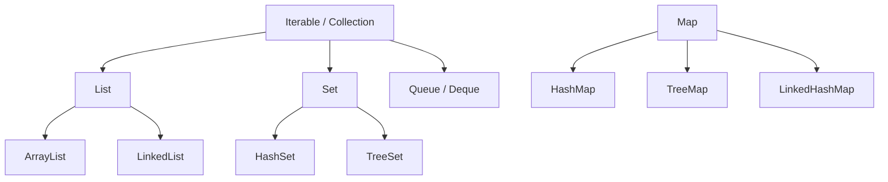
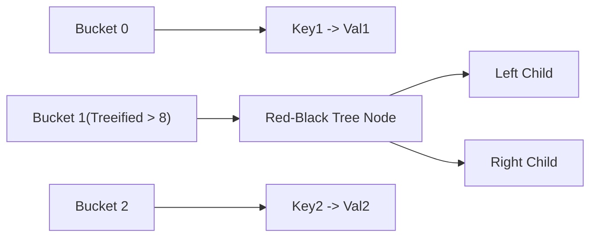

## Question

Explain Java Collections Framework internals: `ArrayList` resizing, `LinkedList` overhead, `HashMap` bucket indexing & red-black tree binning (Java 8+), load factor, `TreeMap` (Red-Black tree), and `LinkedHashMap` for LRU cache.

## Answer

**Java Collections Hierarchy:**



**1. `ArrayList` vs `LinkedList`:**
- **`ArrayList`:** Backed by a dynamic array `Object[]`. Default initial capacity is 10. When full, resizes by 50% (`newCapacity = oldCapacity + (oldCapacity >> 1)`). Fast O(1) random access by index. Cache-friendly due to contiguous memory allocation.
- **`LinkedList`:** Doubly-linked list node objects. O(n) element search. High memory overhead per element (node pointers). Almost never used in modern Java; `ArrayList` or `ArrayDeque` is superior for queues/stacks.

**2. `HashMap` Bucket & TreeBin Internals (Java 8+):**
- **Bucket Indexing:** `index = (n - 1) & hash` (where $n$ is power-of-two array capacity).
- **Collision Resolution:** In Java 7, collisions formed a linked list. In Java 8+, if a bucket collision list exceeds 8 items (`TREEIFY_THRESHOLD = 8`) AND total map capacity is $\ge 64$, the bucket automatically converts from a linked list to a **Red-Black Tree**!
- Search time degrades from O(n) to O($\log n$) worst-case under hash collisions (protecting against HashDoS attacks).



- **Load Factor & Resizing:** Default load factor is `0.75`. When `size > capacity * 0.75`, capacity doubles, and all keys are rehashed into the new table.
- **Optimization Tip:** If you know you will store 10,000 items, initialize `new HashMap<>((int) (10000 / 0.75f) + 1)` to prevent 7 costly resize/rehash cycles!

**3. `TreeMap` (Red-Black Tree):**
Implements `NavigableMap`. Keeps keys sorted by natural ordering or a custom `Comparator`.
- All operations (`get`, `put`, `remove`): O($\log n$) time complexity.
- Useful for range queries (`subMap`, `headMap`, `tailMap`).

**4. `LinkedHashMap` & Building an LRU Cache:**
Extends `HashMap` with a doubly-linked list running through all entries, maintaining insertion order or access order.

```java
// Least-Recently-Used (LRU) Cache in 10 lines of code!
public class LruCache<K, V> extends LinkedHashMap<K, V> {
    private final int maxCapacity;

    public LruCache(int maxCapacity) {
        super(maxCapacity, 0.75f, true); // 'true' enables ACCESS-ORDER (LRU)
        this.maxCapacity = maxCapacity;
    }

    @Override
    protected boolean removeEldestEntry(Map.Entry<K, V> eldest) {
        return size() > maxCapacity; // Evicts oldest entry when size exceeds max
    }
}
```

## Follow-ups

- Why must `hashCode()` and `equals()` contracts be strictly maintained for `HashMap` keys?
- What happens if a mutable object used as a `HashMap` key is modified after insertion?
- How does `IdentityHashMap` differ from standard `HashMap` regarding key comparisons?
